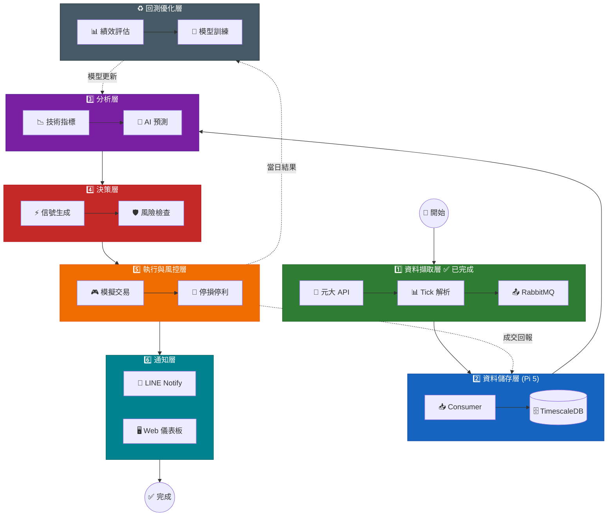
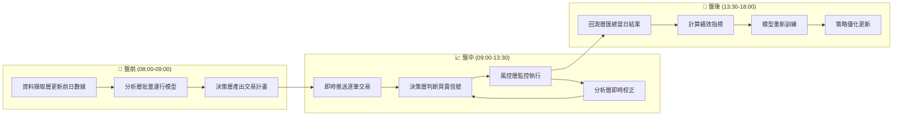
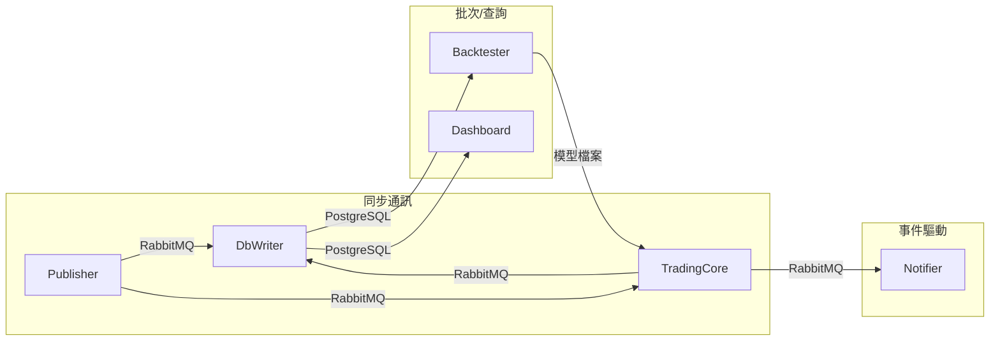
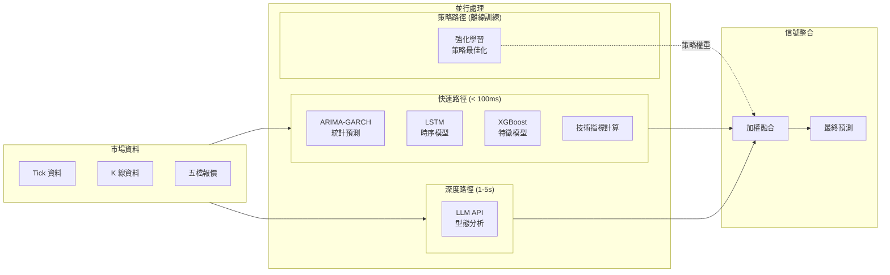
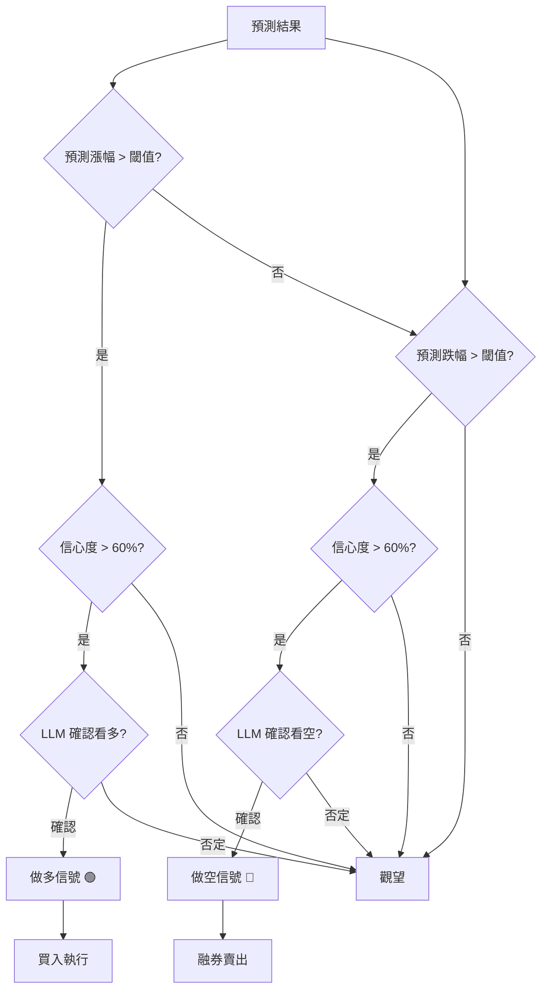
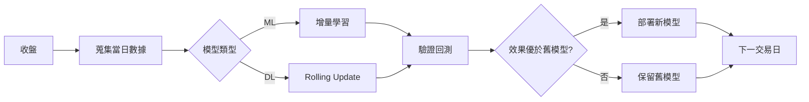
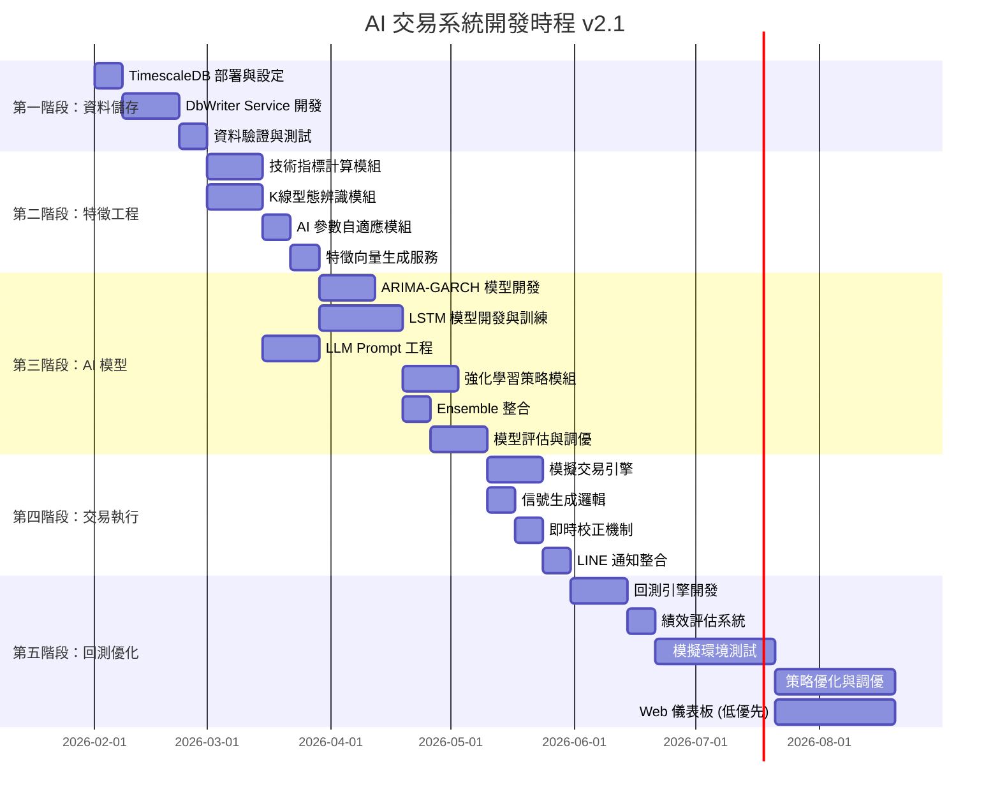
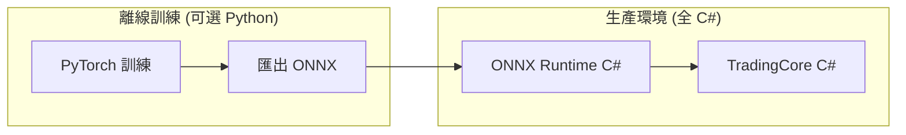

# 主動型 AI 股票預測分析交易系統 - 開發計劃 v2.1

> **文件版本**: 2.1  
> **建立日期**: 2026-01-31  
> **最後更新**: 2026-01-31  
> **狀態**: ✅ 需求確認完成，準備開發  
> **參考文件**: [基於C#的主動型 AI 股票預測分析交易系統規劃報告](基於C%23的主動型%20AI%20股票預測分析交易系統規劃報告.pdf)

---

## 📋 目錄

1. [需求確認摘要](#1-需求確認摘要)
2. [系統架構總覽](#2-系統架構總覽)
3. [資料儲存策略](#3-資料儲存策略建議)
4. [AI 模型方案](#4-ai-方案深度分析與建議)
5. [技術指標整合](#5-技術指標實作規劃)
6. [預測模型架構](#6-預測模型架構)
7. [交易執行策略](#7-交易執行策略)
8. [即時修正與回測機制](#8-即時修正與回測機制)
9. [資料缺口與補充策略](#9-資料缺口評估與補充策略)
10. [LINE 通知整合](#10-line-通知整合)
11. [開發時程](#11-開發時程更新版)
12. [技術棧確認](#12-技術棧確認)
13. [下一步行動](#13-下一步行動)

---

## 1. 需求確認摘要

### ✅ 已確認的系統需求

| 類別 | 需求 | 決策 |
|------|------|------|
| **資料庫** | 時序資料庫 | ✅ 使用 TimescaleDB |
| **資料保留** | 歷史資料期限 | ✅ 5 年 |
| **資料量** | 每日 Tick 筆數 | ≤ 5 萬筆 |
| **預測目標** | 預測內容 | ✅ 當日價格預測 |
| **預測週期** | 預測時間範圍 | ✅ 30分鐘 ~ 2小時（最多3小時） |
| **AI 方案** | 框架選擇 | ⚡ 混合方案（見建議） |
| **技術指標** | 分析項目 | ✅ K線型態、均線趨勢、技術指標、價量關係 |
| **訓練環境** | 運算資源 | ✅ 本地 GPU 或 LLM API |
| **初始資金** | 規模 | ✅ 100 萬 TWD |
| **風險控管** | 嚴格程度 | ⚠️ 忽略（模擬階段） |
| **測試環境** | 執行方式 | ✅ 模擬帳戶優先 |
| **下單策略** | 方式 | ✅ 依預測結果最佳化 |
| **通知管道** | 偏好 | ✅ LINE 優先，備選 Telegram |
| **Web UI** | 需求 | ✅ 需要，但優先度低 |

---

## 2. 系統架構總覽

### 2.1 系統架構圖



### 2.2 五層模組功能對照表

根據 [規劃報告](基於C%23的主動型%20AI%20股票預測分析交易系統規劃報告.pdf) 定義的模組架構：

| 模組 | 功能與責任 | 資料更新頻率/通訊方式 | 實作狀態 |
|------|------------|----------------------|----------|
| **資料擷取層** | 收集歷史行情、三大法人、匯率、國際指數，訂閱台股即時逐筆交易資料流 | 歷史每日盤後；即時毫秒級 (RabbitMQ) | ✅ 已完成 |
| **分析層** | 統計特徵計算、技術指標、AI 模型預測，生成當日預測走勢與交易策略建議 | 盤前批次；盤中事件驅動 | 🔄 待開發 |
| **決策層** | 制定交易計劃、設定進出場條件、資金風險規則，盤中驗證並動態調整 | 盤前產出計畫；盤中事件驅動 | 🔄 待開發 |
| **執行風控層** | 透過券商 API 執行下單、動態停損停利、部位監控、滑點處理 | 毫秒級響應；風控即時監控 | 🔄 待開發 |
| **回測優化層** | 收盤後蒐集結果、績效評估、模型誤差分析、參數調整與重新訓練 | 日終批次；定期回測 | 🔄 待開發 |

### 2.3 每日運行流程



### 2.4 微服務架構設計

根據**延遲需求**、**資源配置**、**執行頻率**和**故障隔離**原則，系統採用以下微服務拆分策略：

#### 2.4.1 各層拆分評估

| 層 | 執行時機 | 延遲要求 | 資源需求 | 拆分決策 |
|-----|----------|----------|----------|----------|
| **資料擷取層** | 盤中即時 | 🔴 低延遲 | CPU | ✅ 獨立服務（元大 API 限制） |
| **資料儲存層** | 盤中即時 | 🟡 中等 | I/O | ✅ 獨立服務（Pi 5 部署） |
| **分析層** | 盤中即時 | 🔴 低延遲 (<100ms) | CPU/GPU | 🔗 合併至交易核心 |
| **決策層** | 盤中即時 | 🔴 低延遲 (<50ms) | CPU | 🔗 合併至交易核心 |
| **執行風控層** | 盤中即時 | 🔴 極低延遲 (<20ms) | CPU | 🔗 合併至交易核心 |
| **通知層** | 事件驅動 | 🟡 中等 (<1s) | 輕量 | ✅ 獨立服務（可插拔） |
| **回測優化層** | 盤後批次 | 🟢 無要求 | GPU 密集 | ✅ 獨立服務（資源隔離） |

#### 2.4.2 服務拆分架構圖

```
┌─────────────────────────────────────────────────────────────────────────────┐
│                           盤中即時服務群                                      │
├─────────────────────────────────────────────────────────────────────────────┤
│                                                                             │
│  ┌─────────────────┐      ┌─────────────────────────────────────────────┐   │
│  │ 1️⃣ 資料擷取服務  │      │ 3️⃣ 交易核心服務 (TradingCore)              │   │
│  │ (Publisher)     │      │                                             │   │
│  │ ┌─────────────┐ │      │  ┌──────────┐  ┌──────────┐  ┌──────────┐  │   │
│  │ │ 元大 API    │ │ Tick │  │ 分析層   │→ │ 決策層   │→ │ 執行層   │  │   │
│  │ │ C# .NET 4.8 │─┼──────┼─▶│ 指標計算 │  │ 信號生成 │  │ 下單執行 │  │   │
│  │ └─────────────┘ │  MQ  │  │ AI 推論  │  │ 風險檢查 │  │ 停損停利 │  │   │
│  └─────────────────┘      │  └──────────┘  └──────────┘  └──────────┘  │   │
│         ✅ 已完成          └─────────────────────────────────────────────┘   │
│                                      │                                      │
│  ┌─────────────────┐                 │ 交易事件                             │
│  │ 2️⃣ 資料儲存服務  │◀────Tick───────┤                                      │
│  │ (DbWriter)      │                 ▼                                      │
│  │ ┌─────────────┐ │      ┌─────────────────────────────────────────────┐   │
│  │ │ TimescaleDB │ │      │ 4️⃣ 通知服務 (Notifier)                      │   │
│  │ │ C# .NET 8   │ │      │ • LINE Notify                               │   │
│  │ └─────────────┘ │      │ • WebSocket (儀表板推送)                     │   │
│  └─────────────────┘      └─────────────────────────────────────────────┘   │
│         ✅ 已完成                                                            │
│                                                                             │
└─────────────────────────────────────────────────────────────────────────────┘

┌─────────────────────────────────────────────────────────────────────────────┐
│                           盤後批次服務群                                      │
├─────────────────────────────────────────────────────────────────────────────┤
│                                                                             │
│  ┌─────────────────────────────────┐   ┌─────────────────────────────────┐  │
│  │ 5️⃣ 回測優化服務 (Backtester)    │   │ 6️⃣ Web 儀表板 (Dashboard)       │  │
│  │ • 績效評估                      │   │ • 歷史資料查詢                   │  │
│  │ • 模型訓練 (GPU)                │   │ • 績效報表                       │  │
│  │ • 策略回測                      │   │ • 設定管理                       │  │
│  └─────────────────────────────────┘   └─────────────────────────────────┘  │
│                                                                             │
└─────────────────────────────────────────────────────────────────────────────┘
```

#### 2.4.3 服務清單與技術棧

| # | 服務名稱 | 包含的層 | 技術棧 | 部署位置 | 狀態 |
|---|----------|----------|--------|----------|------|
| 1 | `AiStockAdvisor.Publisher` | 資料擷取層 | C# .NET 4.8 | Windows | ✅ 已完成 |
| 2 | `AiStockAdvisor.DbWriter` | 資料儲存層 | C# .NET 8 | Pi 5 | ✅ 已完成 |
| 3 | `AiStockAdvisor.TradingCore` | 分析+決策+執行 | **C# .NET 8** | Windows/GPU | 🔄 待開發 |
| 4 | `AiStockAdvisor.Notifier` | 通知層 | **C# .NET 8** | Pi 5 | 🔄 待開發 |
| 5 | `AiStockAdvisor.Backtester` | 回測優化層 | **C# .NET 8** | Windows/GPU | 🔄 待開發 |
| 6 | `AiStockAdvisor.Dashboard` | UI 層 | Blazor / React | Pi 5 或 Cloud | 🔄 待開發 |

> **技術棧統一為 C#**：避免多語言維護成本。

#### 2.4.4 關鍵設計決策

**為什麼「分析+決策+執行」要合併為 TradingCore？**

| 原因 | 說明 |
|------|------|
| **延遲敏感** | Tick → 指標計算 → AI推論 → 信號 → 下單，整個流程需 < 100ms |
| **緊密資料依賴** | 決策層需要分析層的即時輸出，網路延遲會影響交易時機 |
| **狀態共享** | 持倉狀態、風控狀態需要跨層即時同步 |

**為什麼「通知」要獨立？**

| 原因 | 說明 |
|------|------|
| **非關鍵路徑** | 通知失敗不應影響交易執行 |
| **可替換性** | 可隨時切換 LINE → Telegram 等 |
| **限流考量** | LINE Notify 有 API 限制 (1000次/小時) |

**為什麼「回測優化」要獨立？**

| 原因 | 說明 |
|------|------|
| **資源密集** | 模型訓練需要 GPU，不應與盤中交易競爭資源 |
| **執行時間** | 盤後批次執行，可能執行數小時 |
| **版本獨立** | 訓練新模型不影響當前交易 |

#### 2.4.5 服務間通訊



| 通訊類型 | 來源 → 目標 | 方式 | 說明 |
|----------|-------------|------|------|
| Tick 即時推送 | Publisher → DbWriter/TradingCore | RabbitMQ | 低延遲、解耦 |
| 交易事件 | TradingCore → Notifier | RabbitMQ | 非同步、容錯 |
| 歷史資料查詢 | Backtester/Dashboard → DbWriter | SQL | 批次查詢 |
| 模型部署 | Backtester → TradingCore | 檔案系統/API | 版本控制 |

---

## 3. 資料儲存策略建議

### 3.1 資料量估算

| 時間範圍 | Tick 筆數 | 估計大小 |
|----------|----------|----------|
| 每日 | 5 萬筆 | ~10 MB |
| 每月 | 100 萬筆 | ~200 MB |
| 每年 | 1,200 萬筆 | ~2.4 GB |
| 5 年 | 6,000 萬筆 | ~12 GB |

### 3.2 TimescaleDB 優化建議

```sql
-- 建議的資料表結構
CREATE TABLE ticks (
    time        TIMESTAMPTZ NOT NULL,
    trade_date  DATE NOT NULL,
    market_no   SMALLINT NOT NULL,
    stock_code  VARCHAR(10) NOT NULL,
    serial_no   INTEGER NOT NULL,
    price       DECIMAL(10,2) NOT NULL,
    volume      INTEGER NOT NULL,
    PRIMARY KEY (time, market_no, stock_code, serial_no)
);

-- 轉換為 TimescaleDB 超表
SELECT create_hypertable('ticks', 'time', chunk_time_interval => INTERVAL '1 day');

-- 建立複合索引
CREATE INDEX idx_ticks_stock_time ON ticks (stock_code, time DESC);

-- 啟用壓縮 (30天後自動壓縮)
ALTER TABLE ticks SET (
    timescaledb.compress,
    timescaledb.compress_segmentby = 'stock_code, market_no'
);
SELECT add_compression_policy('ticks', INTERVAL '30 days');

-- 資料保留策略 (5年)
SELECT add_retention_policy('ticks', INTERVAL '5 years');
```

### 3.3 壓縮效益預估

| 狀態 | 5年資料大小 |
|------|-------------|
| 未壓縮 | ~12 GB |
| TimescaleDB 壓縮後 | ~1-2 GB（壓縮比 80-90%） |

**建議**：TimescaleDB 的原生壓縮非常高效，對於這個資料量完全足夠，不需要額外的歸檔機制。

---

## 4. AI 方案深度分析與建議

### 4.1 模型方案總覽

根據 [規劃報告](基於C%23的主動型%20AI%20股票預測分析交易系統規劃報告.pdf) 建議，採用混合模型策略：

| 模型類型 | 適用場景 | 所需資料 | 優點 | 缺點 |
|----------|----------|----------|------|------|
| **ARIMA** | 短期價格統計預測 | 歷史價格序列 | 計算快速、解釋性強 | 難以表達非線性關係 |
| **GARCH** | 波動率預測與風險分析 | 歷史收益率序列 | 捕捉波動率聚集特性 | 極端事件表現受限 |
| **LSTM** | 長期複雜時序模式 | 多變量歷史資料 | 自動學習非線性因子 | 需大量資料與計算資源 |
| **XGBoost** | 特徵工程後的分類/回歸 | 結構化特徵 | 效能高、可解釋 | 難以處理序列依賴 |
| **強化學習 (RL)** | 交易策略制定 | 模擬交易環境 | 自主探索最優策略 | 易過度擬合歷史 |
| **LLM** | K線型態解讀、輔助決策 | 文字描述+數據 | 無需訓練、快速迭代 | 延遲較高、API成本 |

### 4.2 方案比較

| 方案 | 優點 | 缺點 | 適用場景 |
|------|------|------|----------|
| **傳統 ML/DL** | 低延遲、可完全自訂、無 API 成本 | 需要大量訓練資料、模型維護 | 核心價格預測 |
| **LLM API** | 無需訓練、可快速迭代、強大推理能力 | 延遲較高、API 成本、Token 限制 | 型態解讀、輔助決策 |

### 4.3 🌟 建議採用：混合架構



### 4.4 ARIMA-GARCH 組合模型

根據規劃報告建議，ARIMA+GARCH 組合可同時描述均值趨勢與波動性：

```python
# ARIMA-GARCH 組合模型範例
from arch import arch_model
from statsmodels.tsa.arima.model import ARIMA

class ArimaGarchModel:
    """
    ARIMA: 描述價格均值變動
    GARCH: 描述殘差的波動性
    """
    def fit(self, returns: pd.Series):
        # Step 1: ARIMA 擬合均值模型
        self.arima = ARIMA(returns, order=(1, 1, 1)).fit()
        residuals = self.arima.resid
        
        # Step 2: GARCH 擬合波動率模型
        self.garch = arch_model(residuals, vol='Garch', p=1, q=1)
        self.garch_result = self.garch.fit(disp='off')
    
    def predict(self, steps=1):
        # 預測均值與波動率
        mean_forecast = self.arima.forecast(steps=steps)
        vol_forecast = self.garch_result.forecast(horizon=steps)
        return {
            'mean': mean_forecast,
            'volatility': vol_forecast.variance.values[-1],
            'confidence_interval': self._calc_ci(mean_forecast, vol_forecast)
        }
```

### 4.5 強化學習策略模組

強化學習將交易過程建模為馬可夫決策過程 (MDP)：

| 元素 | 定義 |
|------|------|
| **狀態 (State)** | 近期價格變化、技術指標、持倉狀況 |
| **動作 (Action)** | 買入、賣出、觀望 |
| **獎勵 (Reward)** | 資產淨值變化或風險調整後利潤 |

```python
# 強化學習交易環境範例
class TradingEnvironment:
    def __init__(self, historical_data):
        self.data = historical_data
        self.position = 0  # -1: 空, 0: 無, 1: 多
        
    def step(self, action):
        """
        action: 0=觀望, 1=買入, 2=賣出
        returns: (next_state, reward, done, info)
        """
        # 計算獎勵：資產淨值變化
        price_change = self.data[self.step_idx] - self.data[self.step_idx - 1]
        reward = self.position * price_change
        
        # 更新持倉
        if action == 1:
            self.position = 1
        elif action == 2:
            self.position = -1
        
        return self._get_state(), reward, self._is_done(), {}
```

### 4.6 各模組角色分配

| 模組 | 技術 | 負責任務 | 觸發頻率 |
|------|------|----------|----------|
| **價格預測核心** | ARIMA-GARCH + LSTM | 30分鐘~2小時價格預測 | 每分鐘 |
| **特徵預測** | XGBoost | 基於技術指標的漲跌分類 | 每分鐘 |
| **K線型態辨識** | LLM (Gemini) | 辨識型態並解讀意義 | 每根 K 線 |
| **趨勢判斷** | 規則引擎 + LLM | 判斷多空趨勢 | 每 5 分鐘 |
| **信號驗證** | LLM (Claude) | 二次確認重要信號 | 僅重大信號 |
| **策略最佳化** | 強化學習 (DQN/PPO) | 學習最優交易策略 | 日終訓練 |

### 4.7 LLM Prompt 設計建議

```markdown
## K線型態分析 Prompt 範例

你是一位專業的技術分析師。請分析以下 K 線資料：

### 輸入資料
- 股票代碼: {stock_code}
- 時間範圍: 過去 20 根 5 分鐘 K 線
- K 線資料 (OHLCV):
{kbar_data_json}

- 技術指標:
  - MA5: {ma5}, MA10: {ma10}, MA20: {ma20}
  - RSI(14): {rsi}
  - MACD: {macd}, Signal: {signal}
  - 成交量 vs 20日均量: {vol_ratio}

### 請回答
1. 識別出的 K 線型態名稱 (如: 晨星、吞噬、錘子線等)
2. 該型態的技術意義 (看多/看空/中性)
3. 信心度 (0-100%)
4. 建議的操作方向 (買入/賣出/觀望)
5. 預測未來 1 小時的價格走向

請以 JSON 格式回覆：
{
  "pattern": "型態名稱",
  "signal": "bullish|bearish|neutral",
  "confidence": 85,
  "action": "buy|sell|hold",
  "price_forecast": {
    "direction": "up|down|sideways",
    "target_range": [low, high]
  },
  "reasoning": "分析理由..."
}
```

### 4.8 LLM API 選擇建議

| API | 優點 | 缺點 | 建議用途 |
|-----|------|------|----------|
| **Gemini** | 成本低、速度快、Flash 版本免費額度 | 中文能力稍弱 | 主力分析 |
| **Claude** | 推理能力強、中文佳 | 成本較高 | 重要信號驗證 |
| **GPT-4** | 綜合能力強 | 成本最高 | 備用 |

**建議配置**：
- 日常分析：Gemini 2.0 Flash（成本效益最高）
- 重要決策：Claude 3.5 Sonnet（更謹慎的推理）

---

## 5. 技術指標實作規劃

### 5.1 四大核心分析模組

#### 📊 模組一：K 線型態 (Candlestick Patterns)

| 型態類型 | 具體型態 | 實作優先級 |
|----------|----------|------------|
| **反轉型態** | 錘子線、吊人線、晨星、夜星、吞噬 | 🔴 高 |
| **持續型態** | 三法(上升/下降)、跳空缺口 | 🟡 中 |
| **猶豫型態** | 十字星、紡錘線 | 🟡 中 |

#### 📈 模組二：均線與趨勢 (Moving Averages & Trends)

| 指標 | 參數 | 用途 |
|------|------|------|
| SMA | 5, 10, 20, 60 | 基礎趨勢判斷 |
| EMA | 12, 26 | MACD 基礎 |
| 布林通道 | (20, 2) | 波動率與支撐壓力 |
| 趨勢線 | 自動識別 | 突破信號 |

#### 📉 模組三：技術指標 (Oscillators & Indicators)

| 指標 | 參數 | 信號類型 |
|------|------|----------|
| RSI | 14 | 超買超賣 |
| KD | (9, 3) | 交叉信號 |
| MACD | (12, 26, 9) | 趨勢動能 |
| ATR | 14 | 波動率 |
| OBV | - | 量能確認 |

#### 📦 模組四：價量關係 (Price-Volume Relationship)

| 分析項目 | 說明 |
|----------|------|
| 量價背離 | 價漲量縮、價跌量增 |
| 爆量突破 | 成交量 > 20日均量 × 2 |
| 量縮整理 | 橫盤時量能萎縮 |
| 五檔委託量比 | 委買量 / 委賣量 |

### 5.3 AI 增強技術指標

根據 [規劃報告](基於C%23的主動型%20AI%20股票預測分析交易系統規劃報告.pdf) 建議，應用 AI 提升傳統指標的使用效能：

#### 🎯 參數自適應優化

傳統指標參數往往固定不變，AI 可根據市場環境動態調整：

```python
class AdaptiveIndicator:
    """
    AI 自適應參數調整
    - 高波動時：縮短均線週期（更靈敏）
    - 低波動時：拉長均線週期（更平滑）
    """
    def __init__(self, base_period=20):
        self.base_period = base_period
        self.volatility_model = self._load_volatility_model()
    
    def get_adaptive_period(self, market_data):
        volatility = self.volatility_model.predict(market_data)
        # 波動率高時縮短週期，波動率低時拉長週期
        adjustment = 1.0 - (volatility - 0.5) * 0.5
        return int(self.base_period * adjustment)
```

> 📊 **實證效果**：AI 調適 RSI 參數可減少約 65% 的假信號

#### 🔀 多指標融合

建立多層感知器 (MLP) 融合多維度指標信號：

```python
class MultiIndicatorFusion:
    """
    融合多個技術指標提高決策可靠度
    輸入: RSI, MACD, 布林帶, 成交量等
    輸出: 綜合交易信號分數 (0-100)
    """
    def __init__(self):
        self.model = self._build_fusion_model()
    
    def _build_fusion_model(self):
        return Sequential([
            Dense(64, activation='relu', input_shape=(15,)),  # 15個指標
            Dropout(0.3),
            Dense(32, activation='relu'),
            Dense(1, activation='sigmoid')  # 輸出信號強度
        ])
    
    def get_signal_score(self, indicators: dict) -> float:
        features = self._extract_features(indicators)
        return self.model.predict(features)[0] * 100
```

> 決策層可參考模型給出的綜合信號分數，只在分數高於閾值時執行交易

#### 🚨 異常模式偵測

運用自動編碼器辨識歷史上罕見的指標組合模式：

```python
class AnomalyDetector:
    """
    使用 Autoencoder 偵測異常指標組合
    - 重建誤差大 → 可能預示特殊市場狀況
    """
    def __init__(self):
        self.autoencoder = self._build_autoencoder()
        self.threshold = None
    
    def detect_anomaly(self, indicator_vector):
        reconstruction = self.autoencoder.predict(indicator_vector)
        error = np.mean((indicator_vector - reconstruction) ** 2)
        
        if error > self.threshold:
            return {
                'is_anomaly': True,
                'error_score': error,
                'recommendation': '謹慎交易，考慮減少倉位'
            }
        return {'is_anomaly': False}
```

### 5.4 特徵向量設計

```python
# 每個預測點的特徵向量 (約 50-100 維)
feature_vector = {
    # 價格特徵 (10維)
    "price_change_1m": 0.5,      # 1分鐘漲跌幅
    "price_change_5m": 1.2,      # 5分鐘漲跌幅
    "price_change_30m": 2.1,     # 30分鐘漲跌幅
    "price_position_bb": 0.75,   # 布林通道位置 (0-1)
    "price_vs_ma5": 1.01,        # 價格/MA5
    "price_vs_ma10": 1.02,
    "price_vs_ma20": 0.99,
    # ...
    
    # 技術指標 (15維)
    "rsi_14": 65,
    "kd_k": 70,
    "kd_d": 68,
    "macd": 0.5,
    "macd_signal": 0.3,
    "macd_histogram": 0.2,
    # ...
    
    # 成交量特徵 (10維)
    "volume_ratio_ma20": 1.5,    # 量比
    "obv_trend": 1,              # OBV 趨勢方向
    "volume_price_divergence": 0, # 量價背離 (-1, 0, 1)
    # ...
    
    # 委託簿特徵 (10維)
    "bid_ask_ratio": 1.2,        # 委買/委賣量比
    "bid_pressure": 0.6,         # 買壓強度
    "ask_pressure": 0.4,         # 賣壓強度
    # ...
    
    # K線型態 (One-hot, 20維)
    "pattern_hammer": 0,
    "pattern_engulfing_bull": 1,
    "pattern_morning_star": 0,
    # ...
    
    # 時間特徵 (5維)
    "minutes_since_open": 120,
    "is_first_hour": 0,
    "is_last_hour": 0,
    # ...
}
```

---

## 6. 預測模型架構

### 6.1 時序預測模型 (核心)

```
                        ┌─────────────────────────────────┐
                        │       輸入: 特徵序列            │
                        │   (過去 60 分鐘, 每分鐘 1 點)   │
                        └──────────────┬──────────────────┘
                                       │
                        ┌──────────────▼──────────────────┐
                        │         LSTM 編碼器             │
                        │      (2層, 128 units)          │
                        └──────────────┬──────────────────┘
                                       │
              ┌────────────────────────┴────────────────────────┐
              │                                                  │
    ┌─────────▼─────────┐                           ┌───────────▼───────────┐
    │   價格預測 Head   │                           │   信心度預測 Head     │
    │   (Dense + Reg)   │                           │   (Dense + Softmax)   │
    └─────────┬─────────┘                           └───────────┬───────────┘
              │                                                  │
    ┌─────────▼─────────┐                           ┌───────────▼───────────┐
    │  30m/1h/2h 預測價格│                          │   高/中/低 信心度     │
    └───────────────────┘                           └───────────────────────┘
```

### 6.2 預測輸出格式

```json
{
  "timestamp": "2026-01-31T10:30:00+08:00",
  "stock_code": "2330",
  "current_price": 580.0,
  "predictions": {
    "30min": {
      "predicted_price": 582.5,
      "price_range": [581.0, 584.0],
      "direction": "up",
      "confidence": 0.72
    },
    "1hour": {
      "predicted_price": 585.0,
      "price_range": [582.0, 588.0],
      "direction": "up",
      "confidence": 0.65
    },
    "2hour": {
      "predicted_price": 583.0,
      "price_range": [578.0, 588.0],
      "direction": "sideways",
      "confidence": 0.55
    }
  },
  "technical_signals": {
    "trend": "bullish",
    "momentum": "positive",
    "volume_signal": "confirming"
  },
  "llm_analysis": {
    "pattern": "突破型態",
    "interpretation": "價格站上 MA20，且成交量放大，短期看多",
    "risk_level": "medium"
  }
}
```

---

## 7. 交易執行策略

> ⚡ **策略定位**：本系統以**當沖交易**為主，所有部位於當日收盤前平倉，不留隔夜風險。

### 7.1 信號轉換邏輯



### 7.2 當沖交易策略

#### 📈 做多策略 (Long)

| 情境 | 策略 | 說明 |
|------|------|------|
| **進場條件** | 預測上漲 > 0.5%，信心度 > 60% | 搭配 LLM 確認 |
| **進場方式** | 限價單 (現價 + 0.1%) | 避免追高 |
| **停利** | 觸及預測目標價 或 獲利 > 1% | 落袋為安 |
| **停損** | 跌破進場價 0.5% | 快速認賠 |
| **強制平倉** | 收盤前 15 分鐘 (13:15) | 當沖必平 |

#### 📉 做空策略 (Short)

| 情境 | 策略 | 說明 |
|------|------|------|
| **進場條件** | 預測下跌 > 0.5%，信心度 > 60% | 搭配 LLM 確認 |
| **進場方式** | 融券賣出 (現價 - 0.1%) | 避免追空 |
| **停利** | 觸及預測目標價 或 獲利 > 1% | 回補獲利 |
| **停損** | 漲破進場價 0.5% | 快速停損 |
| **強制平倉** | 收盤前 15 分鐘 (13:15) | 當沖必平 |

#### ⏰ 當沖時間管理

| 時段 | 策略調整 |
|------|----------|
| **開盤 30 分鐘** (09:00-09:30) | 觀察為主，波動大不輕易進場 |
| **主交易時段** (09:30-12:30) | 正常執行多空策略 |
| **收盤前 1 小時** (12:30-13:15) | 只平倉不開新倉 |
| **強制平倉時段** (13:15-13:30) | 所有部位強制平倉 |

### 7.3 部位管理

```python
class DayTradePositionManager:
    """
    當沖部位管理器
    """
    def __init__(self, max_position_pct=0.3):
        self.max_position_pct = max_position_pct  # 單一標的最大部位 30%
        self.positions = {}  # {stock_code: Position}
    
    def can_open_position(self, stock_code, direction, amount):
        # 檢查是否可以開倉
        current_exposure = self._calculate_exposure()
        if current_exposure + amount > self.total_capital * self.max_position_pct:
            return False, "超過單一標的部位限制"
        return True, None
    
    def force_close_all(self):
        """
        強制平倉所有部位（收盤前執行）
        """
        for stock_code, position in self.positions.items():
            if position.direction == 'LONG':
                self._market_sell(stock_code, position.quantity)
            else:  # SHORT
                self._market_buy_to_cover(stock_code, position.quantity)
        self.positions.clear()
```

### 7.4 模擬交易引擎

```csharp
public class SimulatedOrderExecutor : IOrderExecutor
{
    public Order PlaceOrder(OrderRequest request)
    {
        // 支援多空雙向交易
        // request.Direction: LONG (做多) / SHORT (做空)
        // 模擬成交：假設限價單在價格觸及時立即成交
        // 市價單以當前價格成交
        // 記錄所有交易用於績效分析
    }
    
    public void ForceCloseAllPositions(DateTime closeTime)
    {
        // 收盤前強制平倉所有當沖部位
    }
}
```

---

## 8. 即時修正與回測機制

根據 [規劃報告](基於C%23的主動型%20AI%20股票預測分析交易系統規劃報告.pdf) 第 5 章設計的閉環校正機制。

### 8.1 盤中即時修正 (Real-time Correction)

為確保交易策略隨市場變化保持有效，系統需實現即時校正機制：

#### 📡 即時驗證監控

```python
class RealtimeValidator:
    """
    監控預測與實際走勢的偏差
    """
    def __init__(self, threshold_pct=1.0):
        self.threshold = threshold_pct
        self.predictions = {}
    
    def check_deviation(self, stock_code, actual_price):
        pred = self.predictions.get(stock_code)
        if not pred:
            return None
        
        deviation = abs(actual_price - pred['price']) / pred['price'] * 100
        
        if deviation > self.threshold:
            return {
                'trigger': True,
                'deviation_pct': deviation,
                'action': 'REPREDICT',  # 觸發重新預測
                'message': f'價格偏離預測 {deviation:.1f}%，超過閾值 {self.threshold}%'
            }
        return {'trigger': False}
```

#### 🔄 計畫動態調整

| 觸發條件 | 調整動作 |
|----------|----------|
| 價格突破預測支撐位 | 暫停多頭策略，啟動防守 |
| 價格偏離預測 > 閾值 | 觸發分析層重新計算 |
| 風控指標觸發 | 立即減倉或停止交易 |
| 模型輸出異常跳躍 | 暫時將倉位降為零 |

#### 📈 在線學習/參數更新

```python
class OnlineCorrector:
    """
    使用卡爾曼濾波對預測進行即時校正
    """
    def __init__(self):
        self.kalman = KalmanFilter(dim_x=2, dim_z=1)
        self._init_kalman()
    
    def correct_prediction(self, raw_prediction, actual_observation):
        # 預測步驟
        self.kalman.predict()
        
        # 更新步驟（融合觀測值）
        self.kalman.update(actual_observation)
        
        # 返回校正後的預測
        return {
            'corrected_price': self.kalman.x[0],
            'confidence': 1.0 / self.kalman.P[0, 0]
        }
```

### 8.2 收盤後回測與優化 (Post-market Backtesting)

每日交易結束後進行全面的事後分析：

#### 📊 績效評估指標

| 指標類別 | 指標名稱 | 說明 | 目標值 |
|----------|----------|------|--------|
| **獲利能力** | 勝率 | 盈利交易佔比 | > 50% |
| | 日收益率 | 當日獲利百分比 | > 0 |
| | 累積收益 | 總獲利金額 | 持續增長 |
| **風險控制** | 最大回撤 | Peak-to-trough 最大資本跌幅 | < 10% |
| | 夏普比率 | 風險調整後報酬 | > 1.0 |
| **模型精度** | Precision | 預測信號正確比例 | > 55% |
| | Recall | 實際行情被成功抓住的比例 | > 50% |
| | MSE/RMSE | 價格預測誤差 | 越小越好 |

> **夏普比率** = (策略報酬率 - 無風險利率) / 策略報酬標準差

#### 🔍 交易信號診斷

```python
class SignalDiagnostics:
    """
    分析每一次交易信號的結果（多空雙向）
    """
    def analyze_signals(self, signals, outcomes):
        # 做多信號診斷
        long_results = {
            'TP': 0,  # True Positive: 做多且獲利
            'FP': 0,  # False Positive: 做多但虧損
            'TN': 0,  # True Negative: 不做多且正確
            'FN': 0,  # False Negative: 錯過做多獲利機會
        }
        
        # 做空信號診斷
        short_results = {
            'TP': 0,  # True Positive: 做空且獲利
            'FP': 0,  # False Positive: 做空但虧損
            'TN': 0,  # True Negative: 不做空且正確
            'FN': 0,  # False Negative: 錯過做空獲利機會
        }
        
        for signal, outcome in zip(signals, outcomes):
            if signal['direction'] == 'LONG':
                category = self._classify_long(signal, outcome)
                long_results[category] += 1
            elif signal['direction'] == 'SHORT':
                category = self._classify_short(signal, outcome)
                short_results[category] += 1
        
        # 綜合診斷報告
        return {
            'long': {
                'precision': self._safe_div(long_results['TP'], long_results['TP'] + long_results['FP']),
                'recall': self._safe_div(long_results['TP'], long_results['TP'] + long_results['FN']),
                'win_rate': self._safe_div(long_results['TP'], long_results['TP'] + long_results['FP']),
                'count': long_results['TP'] + long_results['FP'],
            },
            'short': {
                'precision': self._safe_div(short_results['TP'], short_results['TP'] + short_results['FP']),
                'recall': self._safe_div(short_results['TP'], short_results['TP'] + short_results['FN']),
                'win_rate': self._safe_div(short_results['TP'], short_results['TP'] + short_results['FP']),
                'count': short_results['TP'] + short_results['FP'],
            },
            'overall': {
                'total_trades': sum(long_results.values()) + sum(short_results.values()),
                'long_short_ratio': self._safe_div(
                    long_results['TP'] + long_results['FP'],
                    short_results['TP'] + short_results['FP']
                ),
            },
            'common_errors': self._analyze_error_patterns(signals, outcomes)
        }
    
    def _classify_long(self, signal, outcome):
        """分類做多信號結果"""
        if signal['action'] == 'BUY' and outcome['profit'] > 0:
            return 'TP'
        elif signal['action'] == 'BUY' and outcome['profit'] <= 0:
            return 'FP'
        elif signal['action'] == 'HOLD' and outcome['potential_long_profit'] <= 0:
            return 'TN'
        else:
            return 'FN'
    
    def _classify_short(self, signal, outcome):
        """分類做空信號結果"""
        if signal['action'] == 'SHORT' and outcome['profit'] > 0:
            return 'TP'
        elif signal['action'] == 'SHORT' and outcome['profit'] <= 0:
            return 'FP'
        elif signal['action'] == 'HOLD' and outcome['potential_short_profit'] <= 0:
            return 'TN'
        else:
            return 'FN'
```

#### 📊 多空績效對比

| 指標 | 做多 | 做空 | 說明 |
|------|------|------|------|
| 勝率 | 目標 > 50% | 目標 > 50% | 各自獨立計算 |
| 平均獲利 | 追蹤 | 追蹤 | 比較多空效率 |
| 平均虧損 | 追蹤 | 追蹤 | 評估停損效果 |
| 盈虧比 | > 1.5 | > 1.5 | 獲利/虧損比例 |
| 交易次數 | 追蹤 | 追蹤 | 評估多空偏好 |

#### 🔄 模型迭代訓練



#### ⚙️ 模型版本控制

```yaml
# model_registry.yaml
models:
  lstm_v3:
    version: "3.2.1"
    deployed_at: "2026-01-31"
    sharpe_ratio: 1.25
    precision: 0.58
    status: "active"
  
  lstm_v2:
    version: "2.8.0"
    sharpe_ratio: 1.15
    status: "standby"  # 備用
    
  arima_garch:
    version: "1.0.0"
    sharpe_ratio: 0.95
    status: "active"
```

> ⚠️ **重要原則**：避免因一兩天的異常損益就過度修改模型。只有當回測顯示新模型在足夠長期間顯著優於舊模型時才升級。

---

## 9. 資料缺口評估與補充策略

根據 [規劃報告](基於C%23的主動型%20AI%20股票預測分析交易系統規劃報告.pdf) 第 3 章的資料完整性評估。

### 9.1 潛在資料缺口

| 缺失資訊 | 對預測精準度的影響 | 優先級 |
|----------|---------------------|--------|
| **產業新聞與突發事件** | 無法預期突發消息導致的劇烈波動（如法說會利好）| 🔴 高 |
| **融資融券籌碼動態** | 難以捕捉市場過熱/過度悲觀信號，無法預警軋空風險 | 🟡 中 |
| **法說會紀要與財務預測** | 僅憑過去價格難以調整中長期趨勢預測 | 🟡 中 |
| **宏觀與市場連動因子** | 無法提前預警聯動行情（如國際利空導致科技股下跌）| 🟡 中 |

### 9.2 資料補充策略

#### 策略一：擴充資料來源

| 資料類型 | 潛在來源 | 實作難度 |
|----------|----------|----------|
| 財經新聞 | 新聞 API / RSS Feed | 🟢 易 |
| 融資融券日報 | 證交所公開資料 | 🟢 易 |
| 法說會摘要 | 公開資訊觀測站 | 🟡 中 |
| 經濟日曆 | 經濟數據 API | 🟢 易 |

#### 策略二：替代變數

當無法取得特定資料時，使用替代指標：

| 缺少資料 | 替代變數 |
|----------|----------|
| 新聞情緒 | 當日交易量異常、同產業 ETF 波動 |
| 融資融券 | 五檔委託量比變化、價格急漲急跌 |

#### 策略三：防護機制

對於無法量化的資訊（如黑天鵝事件），在決策層設定保護機制：

```python
class BlackSwanProtection:
    """
    極端行情防護機制
    """
    def check_market_anomaly(self, market_data):
        # 行情急跌檢測
        if market_data['price_change_5min'] < -2.0:
            return {
                'action': 'HALT_TRADING',
                'reason': '5分鐘內急跌超過2%',
                'recommendation': '暫停交易策略，等待市場穩定'
            }
        
        # 成交量異常檢測
        if market_data['volume_ratio'] > 5.0:
            return {
                'action': 'REDUCE_POSITION',
                'reason': '成交量異常放大 (5倍均量)',
                'recommendation': '減少持倉，提高風控門檻'
            }
        
        return {'action': 'NORMAL'}
```

---

## 10. LINE 通知整合

### 10.1 通知類型

| 類型 | 觸發條件 | 訊息範例 |
|------|----------|----------|
| **買入信號** | 產生買入信號 | 🟢 買入信號: 2330 台積電 @580, 預測 30分後 585 (+0.86%) |
| **賣出信號** | 達到停利/停損 | 🔴 賣出: 2330 @583, 獲利 +3,000 (+0.5%) |
| **異常警報** | 系統異常 | ⚠️ 系統警告: RabbitMQ 連線中斷 |
| **日報** | 每日收盤後 | 📊 今日績效: +5,200 (0.52%), 交易 3 筆, 勝率 66% |

### 10.2 LINE Notify 整合

```csharp
public class LineNotifyService : INotificationService
{
    private readonly string _token;
    private readonly HttpClient _client;

    public async Task SendAsync(string message)
    {
        var content = new FormUrlEncodedContent(new[]
        {
            new KeyValuePair<string, string>("message", message)
        });
        
        _client.DefaultRequestHeaders.Authorization = 
            new AuthenticationHeaderValue("Bearer", _token);
            
        await _client.PostAsync(
            "https://notify-api.line.me/api/notify", 
            content);
    }
}
```

---

## 11. 開發時程 (更新版)



---

## 12. 技術棧確認

### 12.1 確定採用

| 類別 | 技術 | 說明 |
|------|------|------|
| 資料擷取 | C# .NET 4.8 | 元大 API 相容性 |
| 訊息佇列 | RabbitMQ | 已部署 |
| 時序資料庫 | **TimescaleDB** | PostgreSQL 擴展 |
| 後端服務 | **C# .NET 8** | 所有微服務統一使用 |
| AI 訓練/推論 | **ML.NET / ONNX Runtime / TorchSharp** | C# AI 生態系 |
| 技術指標 | **TALib.NETCore / Skender.Stock.Indicators** | C# 原生技術指標庫 |
| 統計分析 | **Math.NET Numerics** | ARIMA、GARCH 等統計模型 |
| LLM 整合 | **Gemini API** (主) / **Claude API** (輔) | 透過 HTTP 呼叫 |
| 通知 | **LINE Notify** (HTTP API) / **SignalR** (WebSocket) | 交易信號推播 |

### 12.2 C# AI/ML 工具鏈

```csharp
// NuGet 套件建議
<PackageReference Include="Microsoft.ML" Version="3.0.1" />
<PackageReference Include="Microsoft.ML.OnnxRuntime.Gpu" Version="1.17.0" />
<PackageReference Include="TorchSharp" Version="0.102.0" />
<PackageReference Include="TALib.NETCore" Version="1.1.0" />
<PackageReference Include="Skender.Stock.Indicators" Version="2.5.0" />
<PackageReference Include="MathNet.Numerics" Version="5.0.0" />
<PackageReference Include="Accord.MachineLearning" Version="3.8.0" />
```

#### C# 技術指標範例

```csharp
using Skender.Stock.Indicators;

// 計算技術指標
var quotes = GetHistoricalQuotes(); // List<Quote>

// RSI
var rsi = quotes.GetRsi(14);

// MACD
var macd = quotes.GetMacd(12, 26, 9);

// 布林通道
var bollinger = quotes.GetBollingerBands(20, 2);

// 移動平均
var sma20 = quotes.GetSma(20);
```

#### C# ONNX 模型推論範例

```csharp
using Microsoft.ML.OnnxRuntime;

public class LSTMPredictor
{
    private InferenceSession _session;
    
    public LSTMPredictor(string modelPath)
    {
        // 載入 ONNX 模型（可從 PyTorch 匯出）
        _session = new InferenceSession(modelPath, 
            SessionOptions.MakeSessionOptionWithCudaProvider());
    }
    
    public float[] Predict(float[] inputFeatures)
    {
        var inputTensor = new DenseTensor<float>(inputFeatures, new[] { 1, 60, 50 });
        var inputs = new List<NamedOnnxValue>
        {
            NamedOnnxValue.CreateFromTensor("input", inputTensor)
        };
        
        using var results = _session.Run(inputs);
        return results.First().AsTensor<float>().ToArray();
    }
}
```

#### C# 強化學習範例（使用 Accord.NET）

```csharp
using Accord.MachineLearning;

public class QLearningTrader
{
    private QLearning qLearning;
    
    public QLearningTrader(int states, int actions)
    {
        qLearning = new QLearning(states, actions, 
            learningRate: 0.1, 
            discountFactor: 0.95);
    }
    
    public int DecideAction(int currentState)
    {
        return qLearning.GetAction(currentState);
    }
    
    public void Learn(int state, int action, double reward, int nextState)
    {
        qLearning.UpdateState(state, action, reward, nextState);
    }
}
```

### 12.3 為什麼選擇 C# 而非 Python？

| 考量面向 | C# 優勢 | Python 劣勢 |
|---------|---------|------------|
| **程式碼一致性** | ✅ 整個系統單一語言 | ❌ 需維護兩種語言 |
| **效能** | ✅ 編譯型、低延遲 | ❌ 直譯型、GIL 限制 |
| **元大 API** | ✅ 官方 C# SDK | ❌ 需自行包裝 |
| **部署** | ✅ 單一運行時 | ❌ 需 Python + .NET |
| **型別安全** | ✅ 強型別 | ❌ 動態型別易出錯 |
| **GPU 加速** | ✅ ONNX Runtime GPU | ✅ PyTorch/TF |
| **團隊技能** | ✅ 您偏好 C# | ❓ 學習曲線 |

> **結論**：雖然 Python 的 AI 生態系更豐富，但透過 **ONNX** 格式，可以用 Python 訓練模型，再用 C# 高效推論，兼顧兩者優勢。

### 12.4 混合開發策略（建議）



**最佳實踐**：
- 如果您熟悉 Python 且想用 PyTorch 訓練複雜模型 → 訓練完匯出成 ONNX
- 如果想全程 C# → 使用 ML.NET 或 TorchSharp

---

## 13. 下一步行動

### ✅ 已完成

1. **Pi 5 環境準備** *(2026-01-31 完成)*
   - [x] 安裝 TimescaleDB (v2.25.0 on PostgreSQL 17.7)
   - [x] 建立資料表結構 (stock_ticks 超表、quarantined_messages)
   - [x] 設定壓縮與保留策略 (30天壓縮、5年保留)

2. **DbWriter Service 開發** *(已完成)*
   - [x] RabbitMQ Consumer 實作
   - [x] 批次寫入邏輯
   - [x] 錯誤處理與重試

### 🔄 進行中 (本週)

3. **技術指標模組**
   - [ ] 整合 TA-Lib 或自行實作
   - [ ] 建立特徵計算 Pipeline

4. **LLM 整合 POC**
   - [ ] Gemini API 串接
   - [ ] K線型態分析 Prompt 測試

---

## 附錄 A：已確認問題

> ✅ 所有問題已於 2026-01-31 確認完成

| # | 問題 | 回覆 | 狀態 |
|---|------|------|------|
| 1 | Pi 5 上的 PostgreSQL 是否已安裝？ | ✅ 是，已安裝 | ✅ 已確認 |
| 2 | 本地 GPU 規格為何？ | **RTX 4050** (6GB VRAM) | ✅ 已確認 |
| 3 | 具體要追蹤的股票標的？ | **2327 國巨**、**3090 日電貿** | ✅ 已確認 |
| 4 | 模擬交易期多長後才轉實盤？ | **3 個月** | ✅ 已確認 |

### 📊 追蹤標的資訊

| 股票代碼 | 名稱 | 產業類別 | 備註 |
|----------|------|----------|------|
| 2327 | 國巨 | 被動元件 | 電子零組件龍頭 |
| 3090 | 日電貿 | 電子零組件通路 | 電子通路商 |

### 🖥️ GPU 訓練能力評估

| 項目 | RTX 4050 規格 | 適用性 |
|------|---------------|--------|
| VRAM | 6 GB | ✅ 足夠 LSTM 小批次訓練 |
| CUDA Cores | 2560 | ✅ 適合中小規模模型 |
| 建議 Batch Size | 16-64 | 避免 OOM |
| 預估訓練時間 | 單日模型 ~30 分鐘 | 日終批次訓練可接受 |

> 💡 **建議**：對於較大的 LSTM 或強化學習模型，可使用 gradient checkpointing 或 mixed precision (FP16) 來節省 VRAM

---

## 附錄 B：API 成本估算

### LLM API 每日成本預估

| 場景 | 呼叫次數/日 | Token 數/次 | 月成本 (USD) |
|------|-------------|-------------|--------------|
| K線分析 (Gemini Flash) | 500 | 2,000 | ~$3 |
| 重要信號驗證 (Claude) | 50 | 3,000 | ~$15 |
| **總計** | - | - | **~$20/月** |

> 使用 Gemini 2.0 Flash 可大幅降低成本，必要時才使用 Claude

---

## 附錄 C：效能指標目標

| 指標 | 目標值 | 說明 |
|------|--------|------|
| 預測準確率 (方向) | > 55% | 比隨機猜測顯著 |
| 預測 MAE | < 0.5% | 價格偏差 |
| 系統延遲 | < 1 秒 | 從 Tick 到信號 |
| 模擬期夏普比率 | > 1.0 | 風險調整後報酬 |

---

## 附錄 D：規劃報告參考對照

本計劃基於 [基於C#的主動型 AI 股票預測分析交易系統規劃報告](基於C%23的主動型%20AI%20股票預測分析交易系統規劃報告.pdf) 整理：

| 報告章節 | 本計劃對應章節 | 整合狀態 |
|----------|---------------|----------|
| 1. 系統架構與資料流程 | 2. 系統架構總覽 | ✅ 完成 |
| 2. 數學與經濟模型建議 | 4. AI 模型方案 | ✅ 完成 |
| 3. 資料完整性與缺口評估 | 9. 資料缺口評估 | ✅ 完成 |
| 4. 股票技術分析整合建議 | 5. 技術指標整合 | ✅ 完成 |
| 5. 模型即時修正與回測機制 | 8. 即時修正與回測機制 | ✅ 完成 |

---

*文件結束 - v2.1*
