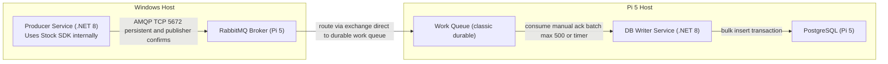

# 範圍說明

此圖為「全系統架構」示意；



## RabbitMQ 連線方式

- Host: `192.168.0.43`
- Port: `5672`
- VHost: `/`（AMQP 需用 `%2F`）
- Username: `admin`
- Password: 以 Pi5 的 `/home/hamowe/Projects/rabbitMQ/.env` 為準
- AMQP URI: `amqp://admin:<PASS>@192.168.0.43:5672/%2F`
- 管理介面: `http://192.168.0.43:15672`

## RabbitMQ Exchange/Queue (direct)

- Exchange: `stock-ex`（type=direct, durable）
- Queue: `work-queue`（durable classic）
- Binding: `stock-ex` -> `work-queue`（routing_key=`stock.twse.tick`）

建立指令：

```bash
rabbitmqadmin -H 192.168.0.43 -P 15672 -u admin -p <PASS> \
  declare exchange name=stock-ex type=direct durable=true

rabbitmqadmin -H 192.168.0.43 -P 15672 -u admin -p <PASS> \
  declare queue name=work-queue durable=true

rabbitmqadmin -H 192.168.0.43 -P 15672 -u admin -p <PASS> \
  declare binding source=stock-ex destination=work-queue routing_key=stock.twse.tick
```
