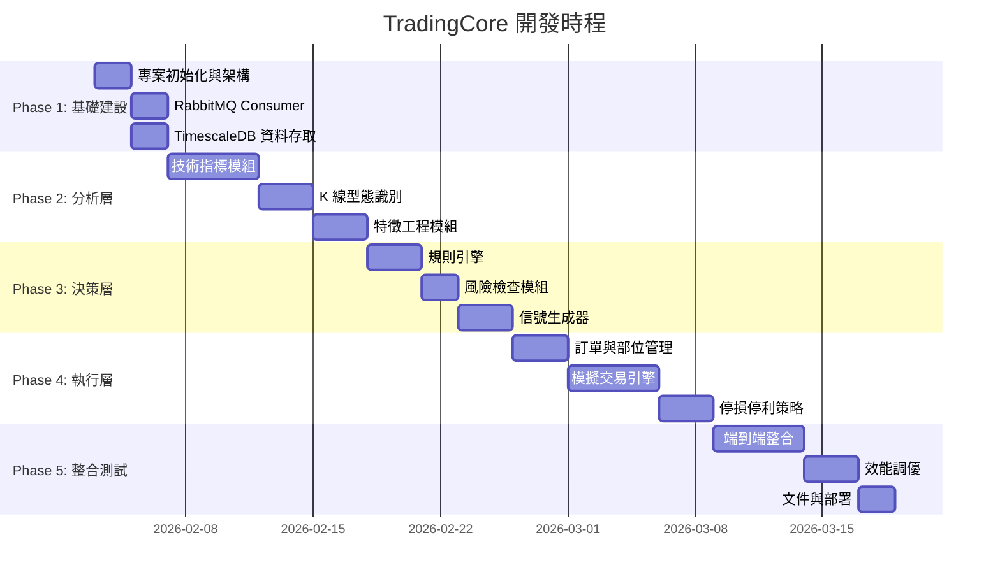
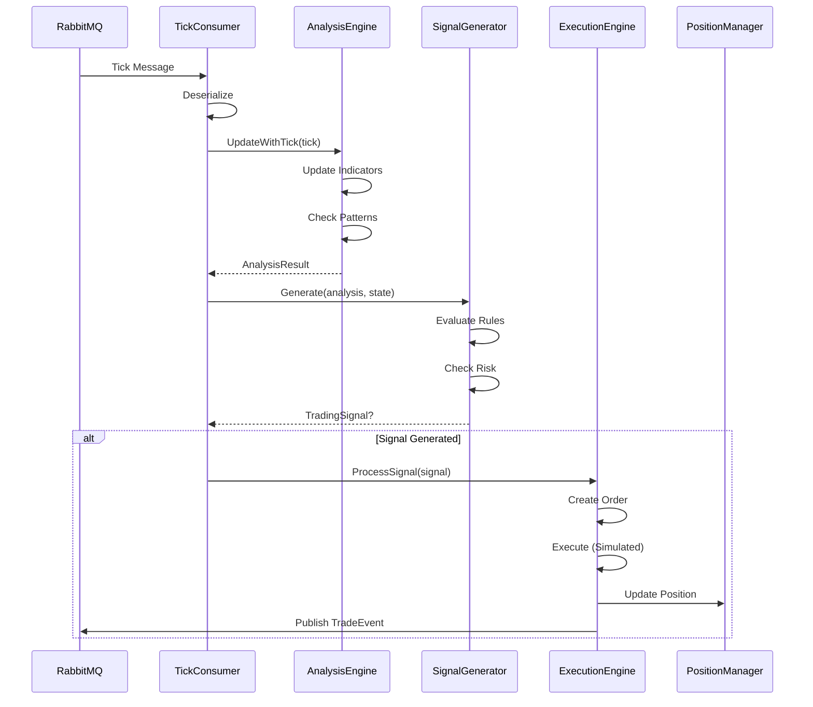

# TradingCore 服務開發計劃

> **文件版本**: 1.0  
> **建立日期**: 2026-02-01  
> **目標服務**: `AiStockAdvisor.TradingCore`  
> **技術棧**: C# .NET 8  
> **預估工時**: 6-8 週

---

## 📋 目錄

1. [服務概述](#1-服務概述)
2. [專案結構](#2-專案結構)
3. [開發階段](#3-開發階段)
4. [詳細任務清單](#4-詳細任務清單)
5. [NuGet 套件依賴](#5-nuget-套件依賴)
6. [介面定義](#6-介面定義)
7. [資料流設計](#7-資料流設計)
8. [驗收標準](#8-驗收標準)

---

## 1. 服務概述

### 1.1 功能範圍

TradingCore 整合**分析層、決策層、執行層**三大功能：

| 子模組 | 責任 | 延遲要求 |
|--------|------|----------|
| **分析層 (Analyzer)** | 技術指標計算、AI 模型推論 | < 50ms |
| **決策層 (SignalGenerator)** | 信號生成、規則判斷 | < 30ms |
| **執行層 (Executor)** | 模擬交易執行、停損停利 | < 20ms |

### 1.2 與現有系統整合

```
┌─────────────────────────────────────────────────────────────────┐
│                      現有系統 (已完成)                           │
├─────────────────────────────────────────────────────────────────┤
│                                                                 │
│  Publisher (C# .NET 4.8)          DbWriter (C# .NET 8)          │
│  ┌─────────────────────┐          ┌─────────────────────┐       │
│  │ 元大 API            │   MQ     │ TimescaleDB         │       │
│  │ → RabbitMQ 發布 Tick├─────────▶│ 儲存歷史資料        │       │
│  └─────────────────────┘          └─────────────────────┘       │
│            │                                │                    │
│            │ RabbitMQ                       │ SQL 查詢           │
│            ▼                                ▼                    │
│  ┌─────────────────────────────────────────────────────────────┐│
│  │              TradingCore (本次開發)                         ││
│  │  ┌──────────┐    ┌──────────┐    ┌──────────┐              ││
│  │  │ Analyzer │ →  │ Signal   │ →  │ Executor │              ││
│  │  │ 指標計算 │    │ Generator│    │ 模擬交易 │              ││
│  │  └──────────┘    └──────────┘    └──────────┘              ││
│  └─────────────────────────────────────────────────────────────┘│
│            │                                                     │
│            │ RabbitMQ (交易事件)                                 │
│            ▼                                                     │
│  ┌─────────────────────┐                                        │
│  │ Notifier (後續開發) │                                        │
│  └─────────────────────┘                                        │
└─────────────────────────────────────────────────────────────────┘
```

### 1.3 目標股票

| 代碼 | 名稱 | 市場 |
|------|------|------|
| 2327 | 國巨 | 上市 |
| 3090 | 日電貿 | 上櫃 |

---

## 2. 專案結構

```
AiStockAdvisor.TradingCore/
├── AiStockAdvisor.TradingCore.csproj
├── Program.cs                          # 主程式進入點
├── appsettings.json                    # 設定檔
│
├── Analysis/                           # 分析層
│   ├── Indicators/                     # 技術指標
│   │   ├── IIndicator.cs              # 指標介面
│   │   ├── SmaIndicator.cs            # 簡單移動平均
│   │   ├── EmaIndicator.cs            # 指數移動平均
│   │   ├── RsiIndicator.cs            # RSI
│   │   ├── MacdIndicator.cs           # MACD
│   │   ├── BollingerBandsIndicator.cs # 布林通道
│   │   ├── KdIndicator.cs             # KD 隨機指標
│   │   └── AtrIndicator.cs            # ATR 波動率
│   │
│   ├── Patterns/                       # K 線型態
│   │   ├── IPatternRecognizer.cs      # 型態識別介面
│   │   ├── HammerPattern.cs           # 錘子線
│   │   ├── EngulfingPattern.cs        # 吞噬型態
│   │   ├── DojiPattern.cs             # 十字星
│   │   └── PatternResult.cs           # 型態識別結果
│   │
│   ├── AI/                             # AI 模型
│   │   ├── IPredictor.cs              # 預測器介面
│   │   ├── OnnxPredictor.cs           # ONNX 模型推論
│   │   └── LlmAnalyzer.cs             # LLM 型態分析
│   │
│   ├── Features/                       # 特徵工程
│   │   ├── FeatureVector.cs           # 特徵向量
│   │   ├── FeatureBuilder.cs          # 特徵建構器
│   │   └── FeatureNormalizer.cs       # 特徵正規化
│   │
│   └── AnalysisEngine.cs              # 分析引擎主類別
│
├── Decision/                           # 決策層
│   ├── Signals/                        # 信號定義
│   │   ├── TradingSignal.cs           # 交易信號
│   │   ├── SignalType.cs              # 信號類型 (買/賣/觀望)
│   │   └── SignalStrength.cs          # 信號強度
│   │
│   ├── Rules/                          # 交易規則
│   │   ├── IRule.cs                   # 規則介面
│   │   ├── TrendFollowingRule.cs      # 順勢規則
│   │   ├── MeanReversionRule.cs       # 均值回歸規則
│   │   └── RuleEngine.cs              # 規則引擎
│   │
│   ├── RiskCheck/                      # 風險檢查
│   │   ├── IRiskChecker.cs            # 風險檢查介面
│   │   ├── PositionLimitChecker.cs    # 部位限制
│   │   ├── DailyLossLimitChecker.cs   # 日損失限制
│   │   └── TimeWindowChecker.cs       # 交易時段檢查
│   │
│   └── SignalGenerator.cs             # 信號生成器主類別
│
├── Execution/                          # 執行層
│   ├── Orders/                         # 訂單管理
│   │   ├── Order.cs                   # 訂單實體
│   │   ├── OrderType.cs               # 訂單類型
│   │   ├── OrderStatus.cs             # 訂單狀態
│   │   └── OrderBook.cs               # 訂單簿
│   │
│   ├── Positions/                      # 部位管理
│   │   ├── Position.cs                # 部位實體
│   │   ├── PositionSide.cs            # 多/空方向
│   │   └── PositionManager.cs         # 部位管理器
│   │
│   ├── Simulation/                     # 模擬交易
│   │   ├── IOrderExecutor.cs          # 執行器介面
│   │   ├── SimulatedExecutor.cs       # 模擬執行器
│   │   ├── SlippageModel.cs           # 滑價模型
│   │   └── FeeCalculator.cs           # 手續費計算
│   │
│   ├── StopLoss/                       # 停損停利
│   │   ├── IStopLossStrategy.cs       # 停損策略介面
│   │   ├── FixedStopLoss.cs           # 固定停損
│   │   ├── TrailingStopLoss.cs        # 追蹤止損
│   │   └── TimeBasedExit.cs           # 時間強制平倉
│   │
│   └── ExecutionEngine.cs             # 執行引擎主類別
│
├── Messaging/                          # 訊息處理
│   ├── TickConsumer.cs                # RabbitMQ Tick 消費者
│   ├── TradeEventPublisher.cs         # 交易事件發布者
│   └── MessageModels/                 # 訊息模型
│       ├── TickMessage.cs             # Tick 訊息 (複用現有)
│       └── TradeEvent.cs              # 交易事件
│
├── Data/                               # 資料存取
│   ├── IHistoricalDataProvider.cs     # 歷史資料介面
│   ├── TimescaleDbProvider.cs         # TimescaleDB 查詢
│   └── InMemoryDataCache.cs           # 記憶體快取
│
├── State/                              # 狀態管理
│   ├── TradingState.cs                # 交易狀態
│   ├── MarketState.cs                 # 市場狀態
│   └── SessionManager.cs              # 交易時段管理
│
└── Hosting/                            # 服務託管
    ├── TradingCoreHostedService.cs    # 背景服務
    └── HealthCheckService.cs          # 健康檢查
```

---

## 3. 開發階段

### 階段總覽



---

## 4. 詳細任務清單

> 💡 **任務格式說明**
> - **User Story**: 說明「為什麼」要做這個任務，以及完成後的價值
> - **實作指引**: 說明「怎麼做」的最佳實踐與注意事項
> - **參考**: 連結相關設計文件或現有程式碼
> - **驗收條件**: 可量化、可測試的完成標準

---

### Phase 1: 基礎建設 (Week 1)

#### Task 1.1: 專案初始化

**User Story**
> 身為開發者，我需要一個結構良好的 .NET 8 專案，
> 以便我可以在統一的框架下開發 TradingCore 的各個模組，
> 並確保與現有 Domain/Application/Infrastructure 層的程式碼相容。

**待辦事項**
- [ ] 建立 `AiStockAdvisor.TradingCore` 專案 (.NET 8 Console)
- [ ] 設定專案參照 (Domain, Application, Infrastructure)
- [ ] 設定 NuGet 套件 (見 [5. NuGet 套件依賴](#5-nuget-套件依賴))
- [ ] 建立 `appsettings.json` 設定檔結構 (見 [附錄 A](#附錄-a-設定檔範例))
- [ ] 設定 DI 容器 (Microsoft.Extensions.DependencyInjection)
- [ ] 設定日誌框架 (Serilog)

**實作指引**
```csharp
// Program.cs 建議結構
var builder = Host.CreateApplicationBuilder(args);

// 1. 設定檔
builder.Configuration
    .AddJsonFile("appsettings.json", optional: false)
    .AddJsonFile($"appsettings.{builder.Environment.EnvironmentName}.json", optional: true)
    .AddEnvironmentVariables();

// 2. Serilog
builder.Services.AddSerilog((services, lc) => lc
    .ReadFrom.Configuration(builder.Configuration)
    .Enrich.FromLogContext()
    .WriteTo.Console()
    .WriteTo.File("logs/trading-core-.log", rollingInterval: RollingInterval.Day));

// 3. DI 註冊 (後續 Task 逐步加入)
builder.Services.AddSingleton<IAnalysisEngine, AnalysisEngine>();
builder.Services.AddSingleton<ISignalGenerator, SignalGenerator>();
builder.Services.AddSingleton<IExecutionEngine, ExecutionEngine>();

// 4. 背景服務
builder.Services.AddHostedService<TradingCoreHostedService>();

var host = builder.Build();
await host.RunAsync();
```

**參考**
- 設定檔範例：[附錄 A](#附錄-a-設定檔範例)
- NuGet 套件：[5. NuGet 套件依賴](#5-nuget-套件依賴)
- 共用資料模型：[Shared-Contracts-Setup.md](Shared-Contracts-Setup.md)（前置作業）

**驗收條件**
| 項目 | 標準 |
|------|------|
| 編譯 | `dotnet build` 成功，無 warning |
| DI | 可解析 `ILogger<T>` 並輸出日誌 |
| 設定 | 可讀取 `appsettings.json` 中的 `TradingCore:Symbols` |
| 專案參照 | 可使用 `AiStockAdvisor.Domain.Tick` 類別 |

---

#### Task 1.2: RabbitMQ Tick Consumer

**User Story**
> 身為 TradingCore 服務，我需要接收 Publisher 發布的即時 Tick 資料，
> 以便分析層可以即時計算技術指標並產生交易信號，
> 確保交易決策基於最新的市場資料。

**待辦事項**
- [ ] 建立 `TickConsumer` 類別
- [ ] 實作 RabbitMQ 連線與自動重連邏輯 (使用 Polly)
- [ ] 實作 Tick 訊息反序列化 (複用 `TickMessage`)
- [ ] 實作背景服務 (`IHostedService`)
- [ ] 建立 `Tick` Domain 物件轉換（見 [Shared-Contracts-Setup.md § 4.1](Shared-Contracts-Setup.md#41-tick-類別)）
- [ ] 單元測試

**實作指引**
```csharp
public class TickConsumer : BackgroundService
{
    private readonly RabbitMqConfig _config;
    private readonly ILogger<TickConsumer> _logger;
    private IConnection? _connection;
    private IModel? _channel;
    
    // 重連策略
    private readonly AsyncRetryPolicy _retryPolicy = Policy
        .Handle<BrokerUnreachableException>()
        .Or<SocketException>()
        .WaitAndRetryForeverAsync(
            retryAttempt => TimeSpan.FromSeconds(Math.Min(30, Math.Pow(2, retryAttempt))),
            (ex, timespan) => _logger.LogWarning("RabbitMQ 連線失敗，{Seconds}秒後重試", timespan.TotalSeconds));

    protected override async Task ExecuteAsync(CancellationToken stoppingToken)
    {
        await _retryPolicy.ExecuteAsync(async () =>
        {
            await ConnectAsync();
            await ConsumeAsync(stoppingToken);
        });
    }
    
    private void HandleMessage(object sender, BasicDeliverEventArgs e)
    {
        try
        {
            var json = Encoding.UTF8.GetString(e.Body.Span);
            var tickMessage = JsonSerializer.Deserialize<TickMessage>(json);
            var tick = tickMessage.ToDomainTick();  // 轉換為 Domain.Tick
            
            OnTickReceived?.Invoke(tick);
            _channel.BasicAck(e.DeliveryTag, false);
        }
        catch (Exception ex)
        {
            _logger.LogError(ex, "處理 Tick 訊息失敗");
            _channel.BasicNack(e.DeliveryTag, false, false);  // 不重新入隊
        }
    }
    
    public event Action<Tick>? OnTickReceived;
}
```

**參考**
- 訊息格式：[Shared-Contracts-Setup.md § 4.3 TickMessage](Shared-Contracts-Setup.md#43-tickmessage-類別)
- RabbitMQ 設定：[Shared-Contracts-Setup.md § 4.4 RabbitMqConfig](Shared-Contracts-Setup.md#44-rabbitmqconfig-類別)
- 訊息規格：[stock-tick-response-json-model.md](stock-tick-response-json-model.md)

**驗收條件**
| 項目 | 標準 |
|------|------|
| 連線 | 可連線至 RabbitMQ (192.168.0.43:5672) |
| 接收 | 可接收 `stock.ticks` exchange 的訊息 |
| 反序列化 | 正確解析 TickMessage 並轉為 Domain.Tick |
| 重連 | RabbitMQ 重啟後 30 秒內自動重連 |
| 錯誤處理 | 異常訊息不會導致 Consumer 中斷 |
| 單元測試 | TickMessage → Tick 轉換測試通過 |

---

#### Task 1.3: TimescaleDB 資料存取

**User Story**
> 身為分析層，我需要查詢歷史 K 線資料，
> 以便計算需要歷史數據的技術指標（如 SMA 20、RSI 14），
> 確保指標在服務啟動時就有足夠的資料進行計算。

**待辦事項**
- [ ] 建立 `IHistoricalDataProvider` 介面
- [ ] 實作 `TimescaleDbProvider` (使用 Npgsql + Dapper)
- [ ] 實作歷史 K 線查詢 (1分/5分/日K)
- [ ] 實作 Tick → K 線聚合查詢
- [ ] 實作 `InMemoryDataCache` 記憶體快取
- [ ] 單元測試

**實作指引**
```csharp
public interface IHistoricalDataProvider
{
    /// <summary>
    /// 查詢歷史 K 線
    /// </summary>
    Task<IReadOnlyList<KBar>> GetKBarsAsync(
        string symbol, 
        DateTime start, 
        DateTime end, 
        TimeSpan interval);
    
    /// <summary>
    /// 查詢最近 N 根 K 線
    /// </summary>
    Task<IReadOnlyList<KBar>> GetRecentKBarsAsync(
        string symbol, 
        int count, 
        TimeSpan interval);
}

public class TimescaleDbProvider : IHistoricalDataProvider
{
    private readonly string _connectionString;
    
    public async Task<IReadOnlyList<KBar>> GetKBarsAsync(
        string symbol, DateTime start, DateTime end, TimeSpan interval)
    {
        await using var conn = new NpgsqlConnection(_connectionString);
        
        // 使用 TimescaleDB time_bucket 聚合
        var sql = @"
            SELECT 
                time_bucket(@interval, time) AS bar_time,
                first(deal_price, time) AS open,
                max(deal_price) AS high,
                min(deal_price) AS low,
                last(deal_price, time) AS close,
                sum(deal_vol) AS volume
            FROM stock_ticks
            WHERE stock_code = @symbol
              AND time >= @start
              AND time < @end
            GROUP BY bar_time
            ORDER BY bar_time";
        
        var results = await conn.QueryAsync<KBarDto>(sql, new 
        { 
            symbol, 
            start, 
            end, 
            interval = interval.ToString() 
        });
        
        return results.Select(r => r.ToKBar()).ToList();
    }
}
```

**參考**
- 資料庫結構：[timescaledb-migration.md](timescaledb-migration.md)
- 資料表 DDL：[stock-tick-ddl.sql](stock-tick-ddl.sql)
- TimescaleDB 文件：`time_bucket()` 聚合函數

**驗收條件**
| 項目 | 標準 |
|------|------|
| 連線 | 可連線至 TimescaleDB (192.168.0.43:5432) |
| 1分K查詢 | `GetKBarsAsync("2327", 今天, 1分鐘)` 回傳正確筆數 |
| 5分K查詢 | 聚合結果的 OHLCV 數值正確 |
| 效能 | 查詢 1 天 1分K (約 270 筆) < 100ms |
| 快取 | 相同查詢第二次 < 1ms |
| 空資料 | 無資料時回傳空集合，不拋例外 |

---

### Phase 2: 分析層 (Week 2-3)

#### Task 2.1: 技術指標基礎模組

**User Story**
> 身為交易策略，我需要即時計算 SMA 和 EMA 指標，
> 以便判斷價格趨勢方向和支撐壓力位，
> 作為進出場決策的基礎依據。

**待辦事項**
- [ ] 建立 `IIndicator` 介面
- [ ] 實作 `SmaIndicator` (簡單移動平均，週期 5/10/20/60)
- [ ] 實作 `EmaIndicator` (指數移動平均，週期 12/26)
- [ ] 單元測試 (對照已知數據驗證)

**實作指引**
```csharp
/// <summary>
/// 技術指標介面
/// 設計原則：增量更新，避免重複計算歷史資料
/// </summary>
public interface IIndicator
{
    string Name { get; }
    int Period { get; }
    bool IsReady { get; }  // 是否有足夠資料計算
    
    void Update(decimal price, decimal volume, DateTime time);
    IndicatorValue? GetValue();
    void Reset();
}

/// <summary>
/// 建議使用 Skender.Stock.Indicators 套件
/// 已實作 150+ 種指標，經過充分測試
/// </summary>
public class SmaIndicatorWrapper : IIndicator
{
    private readonly List<Quote> _quotes = new();
    private readonly int _period;
    
    public void Update(decimal price, decimal volume, DateTime time)
    {
        _quotes.Add(new Quote { Date = time, Close = price, Volume = volume });
        
        // 保留必要筆數，避免記憶體無限增長
        if (_quotes.Count > _period * 2)
            _quotes.RemoveAt(0);
    }
    
    public IndicatorValue? GetValue()
    {
        if (_quotes.Count < _period) return null;
        
        var results = _quotes.GetSma(_period);
        var latest = results.LastOrDefault();
        
        return latest?.Sma.HasValue == true 
            ? new IndicatorValue(Name, latest.Sma.Value, latest.Date)
            : null;
    }
}
```

**參考**
- NuGet 套件：`Skender.Stock.Indicators` (推薦使用)
- 套件文件：https://dotnet.stockindicators.dev/
- 系統規劃：[AI_Trading_System_Development_Plan_v2.md](AI_Trading_System_Development_Plan_v2.md) § 5.技術指標實作規劃

**驗收條件**
| 項目 | 標準 |
|------|------|
| SMA 計算 | SMA(20) 與 TradingView 誤差 < 0.01% |
| EMA 計算 | EMA(12), EMA(26) 與 TradingView 誤差 < 0.01% |
| 資料不足 | Period=20 但只有 10 筆資料時，`IsReady=false` |
| 增量更新 | 每次 Update 時間複雜度 O(1)，不重算全部 |
| 記憶體 | 單一指標記憶體使用 < 1MB |

---

#### Task 2.2: 進階技術指標

**User Story**
> 身為交易策略，我需要 RSI、MACD、KD、布林通道、ATR 等指標，
> 以便綜合判斷超買超賣、趨勢動能、波動率，
> 提供多維度的市場分析依據。

**待辦事項**
- [ ] 實作 `RsiIndicator` (RSI 14)
- [ ] 實作 `MacdIndicator` (12, 26, 9)
- [ ] 實作 `BollingerBandsIndicator` (20, 2)
- [ ] 實作 `KdIndicator` (9, 3, 3)
- [ ] 實作 `AtrIndicator` (14)
- [ ] 單元測試

**實作指引**
```csharp
// 使用 Skender.Stock.Indicators 套件範例
public class IndicatorCalculator
{
    private readonly List<Quote> _quotes;
    
    public IEnumerable<RsiResult> GetRsi(int period = 14) 
        => _quotes.GetRsi(period);
    
    public IEnumerable<MacdResult> GetMacd(int fast = 12, int slow = 26, int signal = 9)
        => _quotes.GetMacd(fast, slow, signal);
    
    public IEnumerable<BollingerBandsResult> GetBollingerBands(int period = 20, decimal stdDev = 2)
        => _quotes.GetBollingerBands(period, stdDev);
    
    public IEnumerable<StochResult> GetKd(int period = 9, int signalPeriod = 3, int smoothPeriod = 3)
        => _quotes.GetStoch(period, signalPeriod, smoothPeriod);
    
    public IEnumerable<AtrResult> GetAtr(int period = 14)
        => _quotes.GetAtr(period);
}
```

**指標意義速查**
| 指標 | 用途 | 常見信號 |
|------|------|----------|
| RSI(14) | 超買超賣 | > 70 超買, < 30 超賣 |
| MACD | 趨勢動能 | 柱狀圖由負轉正 = 多頭信號 |
| BB(20,2) | 波動率 | 價格觸及上軌 = 可能回落 |
| KD(9,3,3) | 短期轉折 | K 上穿 D = 黃金交叉 |
| ATR(14) | 波動率 | 用於計算停損距離 |

**參考**
- 系統規劃：[AI_Trading_System_Development_Plan_v2.md](AI_Trading_System_Development_Plan_v2.md) § 5.3 AI增強技術指標

**驗收條件**
| 項目 | 標準 |
|------|------|
| RSI | 與 TradingView RSI(14) 誤差 < 0.01% |
| MACD | MACD 線、Signal 線、Histogram 皆正確 |
| BB | 中軌 = SMA(20)，上下軌 = ±2σ |
| KD | K 值、D 值範圍 0-100 |
| ATR | 與 TradingView ATR(14) 誤差 < 0.01% |
| 效能 | 更新 1 個 Tick 所有指標 < 1ms |

---

#### Task 2.3: K 線型態識別

**User Story**
> 身為交易策略，我需要自動識別 K 線型態（錘子線、吞噬、十字星等），
> 以便捕捉潛在的反轉或持續信號，
> 減少人工判讀的主觀誤差。

**待辦事項**
- [ ] 建立 `IPatternRecognizer` 介面
- [ ] 實作 `HammerPattern` (錘子線)
- [ ] 實作 `EngulfingPattern` (吞噬型態)
- [ ] 實作 `DojiPattern` (十字星)
- [ ] 實作 `MorningStarPattern` (晨星)
- [ ] 單元測試

**實作指引**
```csharp
public interface IPatternRecognizer
{
    string PatternName { get; }
    PatternSignal Signal { get; }  // Bullish, Bearish, Neutral
    int RequiredBars { get; }      // 需要幾根 K 線判斷
    
    PatternResult? Recognize(IReadOnlyList<KBar> bars);
}

public record PatternResult(
    string PatternName,
    PatternSignal Signal,
    decimal Confidence,     // 0.0 ~ 1.0
    DateTime DetectedAt,
    string Description
);

/// <summary>
/// 錘子線識別邏輯
/// 條件：下影線 > 實體 * 2，上影線很短，出現在下跌趨勢中
/// </summary>
public class HammerPattern : IPatternRecognizer
{
    public string PatternName => "Hammer";
    public PatternSignal Signal => PatternSignal.Bullish;
    public int RequiredBars => 5;  // 需要前 4 根判斷趨勢 + 當前 1 根
    
    public PatternResult? Recognize(IReadOnlyList<KBar> bars)
    {
        if (bars.Count < RequiredBars) return null;
        
        var current = bars[^1];
        var body = Math.Abs(current.Close - current.Open);
        var lowerShadow = Math.Min(current.Open, current.Close) - current.Low;
        var upperShadow = current.High - Math.Max(current.Open, current.Close);
        
        // 錘子線條件
        bool isHammer = lowerShadow > body * 2 
                     && upperShadow < body * 0.3m
                     && body > 0;
        
        // 確認前期下跌趨勢
        bool inDowntrend = bars[^5].Close > bars[^2].Close;
        
        if (isHammer && inDowntrend)
        {
            return new PatternResult(
                PatternName, Signal,
                Confidence: 0.7m,
                DetectedAt: current.Time,
                Description: "錘子線出現在下跌趨勢中，可能反轉向上"
            );
        }
        
        return null;
    }
}
```

**參考**
- K 線型態圖解：TradingView 內建型態說明
- 系統規劃：[AI_Trading_System_Development_Plan_v2.md](AI_Trading_System_Development_Plan_v2.md) § 5.1 模組一：K線型態

**驗收條件**
| 項目 | 標準 |
|------|------|
| 錘子線 | 正確識別下影線 > 2倍實體的 K 線 |
| 吞噬 | 正確識別多頭/空頭吞噬型態 |
| 十字星 | 正確識別開盤價 ≈ 收盤價的 K 線 |
| 晨星 | 正確識別三根 K 線組合型態 |
| 誤報率 | 假陽性 < 20%（對照歷史標記資料）|
| 效能 | 識別所有型態 < 1ms |

#### Task 2.4: 特徵工程模組

**User Story**
> 身為 AI 模型，我需要結構化的特徵向量作為輸入，
> 以便進行價格預測和交易信號分類，
> 確保所有輸入特徵經過正規化，避免量級差異影響模型效果。

**待辦事項**
- [ ] 設計 `FeatureVector` 類別 (約 50 維)
- [ ] 實作 `FeatureBuilder` 
- [ ] 實作 `FeatureNormalizer` (Min-Max / Z-Score)
- [ ] 單元測試

**實作指引**
```csharp
/// <summary>
/// 特徵向量定義（參照 AI_Trading_System_Development_Plan_v2.md § 5.4）
/// </summary>
public class FeatureVector
{
    // 價格特徵 (10維)
    public decimal PriceChange1m { get; set; }      // 1分鐘漲跌幅
    public decimal PriceChange5m { get; set; }      // 5分鐘漲跌幅
    public decimal PriceChange30m { get; set; }     // 30分鐘漲跌幅
    public decimal PricePositionBB { get; set; }    // 布林通道位置 (0-1)
    public decimal PriceVsMa5 { get; set; }         // 價格/MA5
    public decimal PriceVsMa10 { get; set; }        // 價格/MA10
    public decimal PriceVsMa20 { get; set; }        // 價格/MA20
    // ...
    
    // 技術指標特徵 (15維)
    public decimal Rsi14 { get; set; }              // RSI(14)
    public decimal KdK { get; set; }                // KD K值
    public decimal KdD { get; set; }                // KD D值
    public decimal Macd { get; set; }               // MACD
    public decimal MacdSignal { get; set; }         // Signal
    public decimal MacdHistogram { get; set; }      // Histogram
    // ...
    
    // 成交量特徵 (10維)
    public decimal VolumeRatioMa20 { get; set; }    // 量比
    public int ObvTrend { get; set; }               // OBV趨勢 (-1, 0, 1)
    public int VolumePriceDivergence { get; set; } // 量價背離
    // ...
    
    // 時間特徵 (5維)
    public int MinutesSinceOpen { get; set; }       // 開盤後分鐘數
    public bool IsFirstHour { get; set; }           // 是否第一小時
    public bool IsLastHour { get; set; }            // 是否最後一小時
    // ...
    
    // 轉換為陣列供 ML 模型使用
    public float[] ToArray() => new float[]
    {
        (float)PriceChange1m, (float)PriceChange5m, ...
    };
}

public class FeatureNormalizer
{
    public enum Method { MinMax, ZScore }
    
    public float[] Normalize(float[] features, Method method = Method.ZScore)
    {
        return method switch
        {
            Method.MinMax => features.Select(f => (f - _min) / (_max - _min)).ToArray(),
            Method.ZScore => features.Select(f => (f - _mean) / _std).ToArray(),
            _ => features
        };
    }
}
```

**參考**
- 特徵定義：[AI_Trading_System_Development_Plan_v2.md](AI_Trading_System_Development_Plan_v2.md) § 5.4 特徵向量設計

**驗收條件**
| 項目 | 標準 |
|------|------|
| 特徵維度 | 可產出 50 維特徵向量 |
| 數值範圍 | 正規化後所有特徵落在 [-3, 3] (ZScore) 或 [0, 1] (MinMax) |
| 缺失值 | 無 NaN 或 Infinity |
| 效能 | 建構單一特徵向量 < 1ms |

---

#### Task 2.5: 分析引擎整合

**User Story**
> 身為 TradingCore 主程式，我需要一個統一的分析引擎入口，
> 以便將 Tick 資料輸入後獲得完整的分析結果，
> 包含技術指標值、K線型態、特徵向量，供決策層使用。

**待辦事項**
- [ ] 實作 `AnalysisEngine` 主類別
- [ ] 整合所有指標與型態識別
- [ ] 實作 `AnalysisResult` 輸出結構
- [ ] 整合測試

**實作指引**
```csharp
public interface IAnalysisEngine
{
    void UpdateWithTick(Tick tick);
    void UpdateWithKBar(KBar bar);
    AnalysisResult GetLatestResult(string symbol);
}

public class AnalysisResult
{
    public string Symbol { get; init; }
    public DateTime Timestamp { get; init; }
    public decimal CurrentPrice { get; init; }
    
    // 技術指標
    public Dictionary<string, decimal?> Indicators { get; init; }
    // 例: { "RSI_14": 65.5, "MACD": 0.5, "MACD_Signal": 0.3, ... }
    
    // K線型態
    public List<PatternResult> Patterns { get; init; }
    
    // 特徵向量 (供 AI 模型使用)
    public FeatureVector Features { get; init; }
    
    // 趨勢判斷
    public TrendDirection Trend { get; init; }  // Up, Down, Sideways
    
    // 波動率
    public decimal Volatility { get; init; }  // ATR / 價格
}
```

**驗收條件**
| 項目 | 標準 |
|------|------|
| Tick 更新 | 每個 Tick 可即時更新分析結果 |
| 指標完整 | 包含 SMA, EMA, RSI, MACD, BB, KD, ATR |
| 型態識別 | 包含已實作的 4 種 K 線型態 |
| 效能 | 單次 `UpdateWithTick()` < 10ms |

---

### Phase 3: 決策層 (Week 4)

#### Task 3.1: 交易規則引擎

**User Story**
> 身為交易系統，我需要可配置的規則引擎，
> 以便根據不同的市場條件套用不同的交易規則，
> 並在規則衝突時有明確的優先順序處理。

**待辦事項**
- [ ] 建立 `IRule` 介面
- [ ] 實作 `TrendFollowingRule` (順勢交易規則)
- [ ] 實作 `MeanReversionRule` (均值回歸規則)
- [ ] 實作 `RuleEngine` (規則聚合與衝突處理)
- [ ] 單元測試

**實作指引**
```csharp
public interface IRule
{
    string RuleName { get; }
    int Priority { get; }  // 數字越小優先級越高
    bool IsEnabled { get; set; }
    
    RuleResult Evaluate(AnalysisResult analysis, TradingState state);
}

public record RuleResult(
    string RuleName,
    SignalType Signal,         // Buy, Sell, Hold
    SignalStrength Strength,   // Weak, Medium, Strong
    decimal Confidence,        // 0.0 ~ 1.0
    string Reason
);

/// <summary>
/// 順勢交易規則範例
/// </summary>
public class TrendFollowingRule : IRule
{
    public string RuleName => "TrendFollowing";
    public int Priority => 1;
    
    public RuleResult Evaluate(AnalysisResult analysis, TradingState state)
    {
        // 規則 1: MA 黃金交叉 (MA5 上穿 MA20)
        var ma5 = analysis.Indicators["SMA_5"];
        var ma20 = analysis.Indicators["SMA_20"];
        var prevMa5 = analysis.Indicators["SMA_5_Prev"];
        var prevMa20 = analysis.Indicators["SMA_20_Prev"];
        
        bool goldenCross = prevMa5 < prevMa20 && ma5 > ma20;
        bool deathCross = prevMa5 > prevMa20 && ma5 < ma20;
        
        if (goldenCross)
            return new RuleResult(RuleName, SignalType.Buy, SignalStrength.Medium, 0.7m, "MA5 上穿 MA20 黃金交叉");
        
        if (deathCross)
            return new RuleResult(RuleName, SignalType.Sell, SignalStrength.Medium, 0.7m, "MA5 下穿 MA20 死亡交叉");
        
        // 規則 2: 價格突破布林上軌
        var bbUpper = analysis.Indicators["BB_Upper"];
        if (analysis.CurrentPrice > bbUpper)
            return new RuleResult(RuleName, SignalType.Sell, SignalStrength.Weak, 0.5m, "價格突破布林上軌");
        
        return new RuleResult(RuleName, SignalType.Hold, SignalStrength.Weak, 0.3m, "無明確信號");
    }
}

/// <summary>
/// 規則引擎：聚合多個規則，處理衝突
/// </summary>
public class RuleEngine
{
    private readonly List<IRule> _rules;
    
    public RuleResult Evaluate(AnalysisResult analysis, TradingState state)
    {
        var results = _rules
            .Where(r => r.IsEnabled)
            .OrderBy(r => r.Priority)
            .Select(r => r.Evaluate(analysis, state))
            .ToList();
        
        // 衝突處理：取信心度最高的非 Hold 信號
        var actionableSignals = results.Where(r => r.Signal != SignalType.Hold);
        return actionableSignals.OrderByDescending(r => r.Confidence).FirstOrDefault()
            ?? new RuleResult("None", SignalType.Hold, SignalStrength.Weak, 0, "所有規則皆為觀望");
    }
}
```

**參考**
- 交易策略：[AI_Trading_System_Development_Plan_v2.md](AI_Trading_System_Development_Plan_v2.md) § 7.交易執行策略

**驗收條件**
| 項目 | 標準 |
|------|------|
| 黃金交叉 | MA5 上穿 MA20 時產生 Buy 信號 |
| 死亡交叉 | MA5 下穿 MA20 時產生 Sell 信號 |
| RSI 超買 | RSI > 70 時產生 Sell 信號 |
| RSI 超賣 | RSI < 30 時產生 Buy 信號 |
| 規則衝突 | 多規則衝突時取信心度最高者 |

---

#### Task 3.2: 風險檢查模組

**User Story**
> 身為交易系統，我需要風險控管機制，
> 以便在觸發風險條件時阻止交易執行，
> 保護資金安全，避免過度交易。

**待辦事項**
- [ ] 建立 `IRiskChecker` 介面
- [ ] 實作 `PositionLimitChecker` (單一標的 < 30% 資金)
- [ ] 實作 `DailyLossLimitChecker` (當日虧損 < 2%)
- [ ] 實作 `TimeWindowChecker` (交易時段檢查)
- [ ] 單元測試

**實作指引**
```csharp
public interface IRiskChecker
{
    string CheckerName { get; }
    RiskCheckResult Check(TradingSignal signal, TradingState state);
}

public record RiskCheckResult(
    bool IsAllowed,
    string CheckerName,
    string Reason
);

public class TimeWindowChecker : IRiskChecker
{
    public string CheckerName => "TimeWindow";
    
    public RiskCheckResult Check(TradingSignal signal, TradingState state)
    {
        var now = DateTime.Now.TimeOfDay;
        var tradingStart = new TimeSpan(9, 30, 0);   // 09:30 開始交易
        var closingTime = new TimeSpan(13, 15, 0);   // 13:15 停止開倉
        var marketClose = new TimeSpan(13, 30, 0);   // 13:30 收盤
        
        // 開盤前 30 分鐘不交易
        if (now < tradingStart)
            return new RiskCheckResult(false, CheckerName, $"尚未到達交易時段 (09:30)");
        
        // 收盤前 15 分鐘只平倉
        if (now >= closingTime && signal.Type == SignalType.Buy)
            return new RiskCheckResult(false, CheckerName, "13:15 後不開新倉");
        
        return new RiskCheckResult(true, CheckerName, "交易時段正常");
    }
}

public class PositionLimitChecker : IRiskChecker
{
    private readonly decimal _maxPositionPercent = 0.30m;
    
    public RiskCheckResult Check(TradingSignal signal, TradingState state)
    {
        if (signal.Type != SignalType.Buy) 
            return new RiskCheckResult(true, CheckerName, "非買入信號");
        
        var positionValue = signal.TargetPrice * signal.Quantity * 1000;
        var positionRatio = positionValue / state.TotalCapital;
        
        if (positionRatio > _maxPositionPercent)
            return new RiskCheckResult(false, CheckerName, 
                $"部位 {positionRatio:P1} 超過限制 {_maxPositionPercent:P0}");
        
        return new RiskCheckResult(true, CheckerName, "部位限制檢查通過");
    }
}
```

**驗收條件**
| 項目 | 標準 |
|------|------|
| 時段限制 | 09:00~09:30 拒絕所有交易 |
| 收盤限制 | 13:15 後拒絕開倉，允許平倉 |
| 部位限制 | 單一標的 > 30% 資金時拒絕 |
| 日損限制 | 當日虧損 > 2% 時停止交易 |

---

#### Task 3.3: 信號生成器

**User Story**
> 身為決策層的最終輸出，我需要整合規則與風險的信號生成器，
> 以便產生完整的交易信號（包含停損價、目標價），
> 供執行層直接使用下單。

**待辦事項**
- [ ] 實作 `TradingSignal` 類別
- [ ] 實作 `SignalGenerator` 主類別
  - 整合規則引擎結果
  - 整合風險檢查
  - 計算目標價與停損價
- [ ] 整合測試

**實作指引**
```csharp
public class TradingSignal
{
    public string SignalId { get; init; } = Guid.NewGuid().ToString();
    public string Symbol { get; init; }
    public SignalType Type { get; init; }        // Buy, Sell, Hold
    public SignalStrength Strength { get; init; } // Weak, Medium, Strong
    public decimal TargetPrice { get; init; }     // 目標價
    public decimal StopLossPrice { get; init; }   // 停損價
    public int Quantity { get; init; }            // 交易張數
    public decimal Confidence { get; init; }      // 信心度 0~1
    public string Reason { get; init; }           // 信號產生原因
    public DateTime GeneratedAt { get; init; } = DateTime.Now;
    
    // 來源追溯
    public string TriggerRule { get; init; }      // 觸發的規則名稱
    public Dictionary<string, decimal> IndicatorSnapshot { get; init; }  // 當時的指標快照
}

public class SignalGenerator
{
    private readonly RuleEngine _ruleEngine;
    private readonly List<IRiskChecker> _riskCheckers;
    private readonly ILogger _logger;
    
    public TradingSignal Generate(AnalysisResult analysis, TradingState state)
    {
        // Step 1: 規則評估
        var ruleResult = _ruleEngine.Evaluate(analysis, state);
        
        if (ruleResult.Signal == SignalType.Hold)
        {
            return new TradingSignal
            {
                Symbol = analysis.Symbol,
                Type = SignalType.Hold,
                Strength = SignalStrength.Weak,
                Reason = ruleResult.Reason
            };
        }
        
        // Step 2: 風險檢查
        var signal = BuildPreliminarySignal(analysis, ruleResult);
        foreach (var checker in _riskCheckers)
        {
            var checkResult = checker.Check(signal, state);
            if (!checkResult.IsAllowed)
            {
                _logger.Warning($"風險檢查未通過: {checkResult.CheckerName} - {checkResult.Reason}");
                return signal with { Type = SignalType.Hold, Reason = checkResult.Reason };
            }
        }
        
        // Step 3: 計算停損停利
        return signal with
        {
            StopLossPrice = CalculateStopLoss(analysis, signal),
            TargetPrice = CalculateTakeProfit(analysis, signal)
        };
    }
    
    private decimal CalculateStopLoss(AnalysisResult analysis, TradingSignal signal)
    {
        // ATR-based 停損 (2 x ATR)
        var atr = analysis.Indicators["ATR_14"] ?? analysis.CurrentPrice * 0.02m;
        return signal.Type == SignalType.Buy 
            ? analysis.CurrentPrice - (atr * 2)
            : analysis.CurrentPrice + (atr * 2);
    }
}
```

**驗收條件**
| 項目 | 標準 |
|------|------|
| 信號完整 | 包含 Symbol, Type, TargetPrice, StopLossPrice, Quantity |
| 停損計算 | 停損價基於 ATR 計算，距離 1~3% |
| 目標價 | 報酬風險比 >= 2:1 |
| 風險整合 | 任一風險檢查失敗則產生 Hold 信號 |
| 追溯性 | 包含觸發規則名稱與指標快照 |

---

### Phase 4: 執行層 (Week 5-6)

#### Task 4.1: 訂單與部位管理

**User Story**
> 身為執行層，我需要完整的訂單與部位追蹤機制，
> 以便隨時知道未成交訂單、持有部位、未實現盈虧，
> 確保不會重複下單或超額交易。

**待辦事項**
- [ ] 實作 `Order` 實體
- [ ] 實作 `Position` 實體
- [ ] 實作 `PositionManager` (開倉/平倉邏輯、P&L 計算)
- [ ] 實作 `OrderManager` (訂單追蹤)
- [ ] 單元測試

**實作指引**
```csharp
public class Order
{
    public string OrderId { get; init; } = Guid.NewGuid().ToString();
    public string Symbol { get; init; }
    public OrderType Type { get; init; }          // Market, Limit
    public PositionSide Side { get; init; }       // Long, Short
    public int Quantity { get; init; }            // 張數
    public decimal? LimitPrice { get; init; }
    public OrderStatus Status { get; set; } = OrderStatus.Pending;
    public DateTime CreatedAt { get; init; } = DateTime.Now;
    public DateTime? FilledAt { get; set; }
    public decimal? FilledPrice { get; set; }
    public decimal? Commission { get; set; }      // 手續費
    public decimal? Tax { get; set; }             // 證交稅
    
    // 來源追溯
    public string SignalId { get; init; }
}

public enum OrderStatus { Pending, Sent, PartialFilled, Filled, Cancelled, Rejected }

public class Position
{
    public string PositionId { get; init; } = Guid.NewGuid().ToString();
    public string Symbol { get; init; }
    public PositionSide Side { get; init; }
    public int Quantity { get; set; }             // 剩餘張數
    public decimal EntryPrice { get; init; }      // 平均成本
    public DateTime OpenedAt { get; init; }
    public decimal CurrentPrice { get; set; }
    
    // 盈虧計算 (每張 = 1000 股)
    public decimal UnrealizedPnL => (CurrentPrice - EntryPrice) * Quantity * 1000 
        * (Side == PositionSide.Long ? 1 : -1);
    public decimal UnrealizedPnLPercent => EntryPrice > 0 
        ? UnrealizedPnL / (EntryPrice * Quantity * 1000) 
        : 0;
}

public class PositionManager
{
    private readonly Dictionary<string, Position> _positions = new();
    
    public void OpenPosition(Order filledOrder)
    {
        var key = $"{filledOrder.Symbol}_{filledOrder.Side}";
        if (_positions.TryGetValue(key, out var existing))
        {
            // 加碼：計算新平均成本
            var totalQty = existing.Quantity + filledOrder.Quantity;
            var avgPrice = ((existing.EntryPrice * existing.Quantity) + 
                (filledOrder.FilledPrice.Value * filledOrder.Quantity)) / totalQty;
            existing.Quantity = totalQty;
            // Note: EntryPrice 需要改用 set 或創建新 Position
        }
        else
        {
            _positions[key] = new Position
            {
                Symbol = filledOrder.Symbol,
                Side = filledOrder.Side,
                Quantity = filledOrder.Quantity,
                EntryPrice = filledOrder.FilledPrice.Value,
                OpenedAt = filledOrder.FilledAt.Value
            };
        }
    }
    
    public decimal GetTotalUnrealizedPnL() => _positions.Values.Sum(p => p.UnrealizedPnL);
}
```

**驗收條件**
| 項目 | 標準 |
|------|------|
| 開倉 | 訂單成交後正確建立 Position |
| 加碼 | 多次買入同標的計算加權平均成本 |
| 平倉 | 平倉後減少 Quantity，完全平倉刪除 Position |
| 盈虧 | 未實現盈虧計算正確 (含多空方向) |
| 成本 | 成本包含手續費與稅金 |

---

#### Task 4.2: 模擬交易引擎

**User Story**
> 身為開發者，我需要可驗證的模擬交易引擎，
> 以便在不連接真實券商的情況下測試交易邏輯，
> 並模擬真實市場的滑價與手續費。

**待辦事項**
- [ ] 實作 `IOrderExecutor` 介面
- [ ] 實作 `SimulatedExecutor` (撮合邏輯)
- [ ] 實作 `SlippageModel` (滑價模擬)
- [ ] 實作 `FeeCalculator` (手續費)
- [ ] 單元測試

**實作指引**
> 請參考 **附錄 C: 模擬交易引擎設計** 的完整實作範例

```csharp
public interface IOrderExecutor
{
    Task<OrderResult> ExecuteAsync(Order order, decimal currentPrice);
    Task<OrderResult> CancelAsync(string orderId);
}

// SimulatedExecutor 完整實作見附錄 C
// SlippageModel 完整實作見附錄 C  
// FeeCalculator 完整實作見附錄 C

// DI 註冊範例 (appsettings.json: "Trading:UseSimulator": true)
services.AddSingleton<IOrderExecutor>(sp =>
{
    var config = sp.GetRequiredService<IConfiguration>();
    var useSimulator = config.GetValue<bool>("Trading:UseSimulator");
    
    return useSimulator
        ? sp.GetRequiredService<SimulatedExecutor>()
        : sp.GetRequiredService<YuantaRealExecutor>();
});
```

**參考**
- 完整實作：見本文件 **附錄 C: 模擬交易引擎設計**
- 切換說明：見本文件 § 模擬交易 → 真實交易的切換

**驗收條件**
| 項目 | 標準 |
|------|------|
| 市價單 | 立即成交，價格 = 現價 + 滑價 |
| 限價單 | 價格觸及時成交 |
| 滑價 | 買單 +0.05%，賣單 -0.05% |
| 手續費 | 券商 0.1425%，最低 20 元 |
| 證交稅 | 賣出 0.3% |
| 成本驗證 | 買入 100 張 @50，成本 = 5,000,000 + 7,125 手續費 |

---

#### Task 4.3: 停損停利策略

**User Story**
> 身為風控機制，我需要自動化的停損停利策略，
> 以便在觸及設定價位或時間條件時自動平倉，
> 保護獲利並限制虧損。

**待辦事項**
- [ ] 實作 `IStopLossStrategy` 介面
- [ ] 實作 `FixedStopLoss` (固定 0.5% 停損)
- [ ] 實作 `TrailingStopLoss` (追蹤止損)
- [ ] 實作 `TimeBasedExit` (13:15 強制平倉)
- [ ] 整合至 `ExecutionEngine`
- [ ] 單元測試

**實作指引**
```csharp
public interface IStopLossStrategy
{
    string StrategyName { get; }
    StopLossResult Evaluate(Position position, decimal currentPrice, DateTime currentTime);
}

public record StopLossResult(
    bool ShouldExit,
    string StrategyName,
    string Reason,
    decimal? ExitPrice = null
);

/// <summary>
/// 固定比例停損/停利
/// </summary>
public class FixedStopLoss : IStopLossStrategy
{
    private readonly decimal _stopLossPercent = 0.005m;  // 0.5%
    private readonly decimal _takeProfitPercent = 0.01m; // 1.0%
    
    public StopLossResult Evaluate(Position position, decimal currentPrice, DateTime currentTime)
    {
        var pnlPercent = position.UnrealizedPnLPercent;
        
        if (pnlPercent <= -_stopLossPercent)
            return new StopLossResult(true, StrategyName, 
                $"觸及停損 {pnlPercent:P2} <= -{_stopLossPercent:P1}", currentPrice);
        
        if (pnlPercent >= _takeProfitPercent)
            return new StopLossResult(true, StrategyName,
                $"觸及停利 {pnlPercent:P2} >= {_takeProfitPercent:P1}", currentPrice);
        
        return new StopLossResult(false, StrategyName, "繼續持有");
    }
}

/// <summary>
/// 追蹤止損 (Trailing Stop)
/// </summary>
public class TrailingStopLoss : IStopLossStrategy
{
    private readonly decimal _trailingPercent = 0.003m;  // 0.3%
    private readonly Dictionary<string, decimal> _highWaterMarks = new();
    
    public StopLossResult Evaluate(Position position, decimal currentPrice, DateTime currentTime)
    {
        var key = position.PositionId;
        
        // 更新最高價
        if (!_highWaterMarks.TryGetValue(key, out var hwm) || currentPrice > hwm)
            _highWaterMarks[key] = currentPrice;
        
        var hwmPrice = _highWaterMarks[key];
        var dropPercent = (hwmPrice - currentPrice) / hwmPrice;
        
        if (dropPercent >= _trailingPercent)
            return new StopLossResult(true, StrategyName,
                $"從最高價 {hwmPrice} 回撤 {dropPercent:P2} >= {_trailingPercent:P1}");
        
        return new StopLossResult(false, StrategyName, "繼續持有");
    }
}

/// <summary>
/// 收盤前強制平倉
/// </summary>
public class TimeBasedExit : IStopLossStrategy
{
    private readonly TimeSpan _forceExitTime = new(13, 15, 0);
    
    public StopLossResult Evaluate(Position position, decimal currentPrice, DateTime currentTime)
    {
        if (currentTime.TimeOfDay >= _forceExitTime)
            return new StopLossResult(true, StrategyName, "13:15 強制平倉");
        
        return new StopLossResult(false, StrategyName, "未到強制平倉時間");
    }
}
```

**驗收條件**
| 項目 | 標準 |
|------|------|
| 固定停損 | 虧損 >= 0.5% 時平倉 |
| 固定停利 | 獲利 >= 1.0% 時平倉 |
| 追蹤止損 | 從最高價回撤 >= 0.3% 時平倉 |
| 時間平倉 | 13:15 後強制平倉所有部位 |
| 多策略 | 任一策略觸發即執行平倉 |

---

#### Task 4.4: 執行引擎整合

**User Story**
> 身為執行層核心，我需要整合所有執行元件的主引擎，
> 以便接收交易信號、建立訂單、執行交易、監控停損停利，
> 並發布交易事件供其他服務訂閱。

**待辦事項**
- [ ] 實作 `ExecutionEngine` 主類別
- [ ] 實作交易事件發布 (`TradeEventPublisher`)
- [ ] 實作 `TradingState` (帳戶狀態追蹤)
- [ ] 整合測試

**實作指引**
```csharp
public class ExecutionEngine
{
    private readonly IOrderExecutor _executor;
    private readonly PositionManager _positionManager;
    private readonly OrderManager _orderManager;
    private readonly List<IStopLossStrategy> _stopLossStrategies;
    private readonly TradeEventPublisher _eventPublisher;
    
    public async Task ProcessSignalAsync(TradingSignal signal, decimal currentPrice)
    {
        if (signal.Type == SignalType.Hold)
            return;
        
        // 建立訂單
        var order = new Order
        {
            Symbol = signal.Symbol,
            Side = signal.Type == SignalType.Buy ? PositionSide.Long : PositionSide.Short,
            Type = OrderType.Limit,
            LimitPrice = signal.TargetPrice,
            Quantity = signal.Quantity,
            SignalId = signal.SignalId
        };
        
        _orderManager.Add(order);
        
        // 執行交易
        var result = await _executor.ExecuteAsync(order, currentPrice);
        
        if (result.Status == OrderStatus.Filled)
        {
            _positionManager.OpenPosition(result.FilledOrder);
            await _eventPublisher.PublishAsync(new TradeExecutedEvent(result.FilledOrder));
        }
    }
    
    public async Task MonitorPositionsAsync(decimal currentPrice)
    {
        foreach (var position in _positionManager.GetAllPositions())
        {
            position.CurrentPrice = currentPrice;
            
            foreach (var strategy in _stopLossStrategies)
            {
                var result = strategy.Evaluate(position, currentPrice, DateTime.Now);
                if (result.ShouldExit)
                {
                    await ClosePositionAsync(position, result.Reason);
                    break;
                }
            }
        }
    }
}

public class TradingState
{
    public decimal InitialCapital { get; init; } = 1_000_000m;
    public decimal TotalCapital => InitialCapital + RealizedPnL + UnrealizedPnL;
    public decimal RealizedPnL { get; set; }
    public decimal UnrealizedPnL { get; set; }
    public decimal DailyPnL { get; set; }
    public int TotalTrades { get; set; }
    public int WinningTrades { get; set; }
    public decimal WinRate => TotalTrades > 0 ? (decimal)WinningTrades / TotalTrades : 0;
}
```

**驗收條件**
| 項目 | 標準 |
|------|------|
| 信號處理 | 接收 TradingSignal 後正確建立 Order |
| 訂單執行 | 透過 IOrderExecutor 執行訂單 |
| 部位更新 | 成交後更新 PositionManager |
| 停損監控 | 每次價格更新檢查所有停損策略 |
| 事件發布 | 成交/平倉事件發布至 RabbitMQ |
| 狀態追蹤 | TradingState 正確反映帳戶盈虧 |

---

### Phase 5: 整合測試與部署 (Week 7-8)

#### Task 5.1: 端到端整合

**User Story**
> 身為交易系統，我需要將所有元件整合為可運行的服務，
> 以便作為 .NET Hosted Service 長期運行，
> 並支援優雅關機與健康檢查。

**待辦事項**
- [ ] 整合 `TickConsumer` → `AnalysisEngine` → `SignalGenerator` → `ExecutionEngine`
- [ ] 實作 `TradingCoreHostedService`
- [ ] 設定 Graceful Shutdown
- [ ] 實作 `HealthCheckService`
- [ ] 端到端測試 (使用歷史資料回放)

**實作指引**
```csharp
public class TradingCoreHostedService : BackgroundService
{
    private readonly ITickConsumer _tickConsumer;
    private readonly IAnalysisEngine _analysisEngine;
    private readonly SignalGenerator _signalGenerator;
    private readonly ExecutionEngine _executionEngine;
    
    protected override async Task ExecuteAsync(CancellationToken stoppingToken)
    {
        _tickConsumer.OnTickReceived += async (sender, tick) =>
        {
            try
            {
                // 1. 更新分析引擎
                _analysisEngine.UpdateWithTick(tick);
                
                // 2. 取得分析結果
                var analysis = _analysisEngine.GetLatestResult(tick.Symbol);
                
                // 3. 生成交易信號
                var signal = _signalGenerator.Generate(analysis, _tradingState);
                
                // 4. 執行交易
                await _executionEngine.ProcessSignalAsync(signal, tick.Price);
                
                // 5. 監控停損停利
                await _executionEngine.MonitorPositionsAsync(tick.Price);
            }
            catch (Exception ex)
            {
                _logger.Error(ex, "處理 Tick 時發生錯誤");
            }
        };
        
        await _tickConsumer.StartAsync(stoppingToken);
    }
    
    public override async Task StopAsync(CancellationToken cancellationToken)
    {
        _logger.Information("收到停止信號，開始優雅關機...");
        
        // 平倉所有部位
        await _executionEngine.CloseAllPositionsAsync("系統關機");
        
        await base.StopAsync(cancellationToken);
    }
}
```

**驗收條件**
| 項目 | 標準 |
|------|------|
| 完整流程 | Tick → Analysis → Signal → Execution 流程可運作 |
| 持續運行 | 可作為 Hosted Service 持續運行 |
| 優雅關機 | Ctrl+C 時平倉所有部位後關閉 |
| 健康檢查 | `/health` 端點回傳服務狀態 |

---

#### Task 5.2: 效能調優

**User Story**
> 身為高頻交易系統，我需要低延遲的處理能力，
> 以便在 Tick 進來後 100ms 內產生交易信號，
> 確保不錯過最佳進場時機。

**待辦事項**
- [ ] 效能測試 (目標: Tick → Signal < 100ms)
- [ ] 記憶體分析與優化
- [ ] 指標計算快取優化
- [ ] RabbitMQ Consumer 批次處理優化

**實作指引**
```csharp
// 效能優化技巧

// 1. 指標快取 (避免重複計算)
public class CachedIndicatorService
{
    private readonly Dictionary<string, (DateTime, decimal)> _cache = new();
    private readonly TimeSpan _cacheExpiry = TimeSpan.FromSeconds(1);
    
    public decimal GetOrCalculate(string key, Func<decimal> calculator)
    {
        if (_cache.TryGetValue(key, out var cached) && 
            DateTime.Now - cached.Item1 < _cacheExpiry)
            return cached.Item2;
        
        var value = calculator();
        _cache[key] = (DateTime.Now, value);
        return value;
    }
}

// 2. 使用 Span<T> 避免記憶體配置
public ReadOnlySpan<decimal> GetPriceWindow(int count)
{
    return _priceBuffer.AsSpan(^count..);
}

// 3. 效能量測
using var activity = ActivitySource.StartActivity("ProcessTick");
var sw = Stopwatch.StartNew();
// ... 處理邏輯
sw.Stop();
_metrics.RecordHistogram("tick_processing_time_ms", sw.ElapsedMilliseconds);
```

**驗收條件**
| 項目 | 標準 |
|------|------|
| 延遲 | P99 延遲 < 100ms |
| 記憶體 | 長時間運行無記憶體洩漏 |
| 吞吐量 | 可處理 100 Ticks/秒 |
| CPU | 穩定狀態 CPU < 30% |

---

#### Task 5.3: 文件與部署

**User Story**
> 身為維運人員，我需要完整的部署文件與自動化腳本，
> 以便透過 Docker Compose 一鍵部署服務，
> 並能快速理解設定參數。

**待辦事項**
- [ ] 撰寫 README.md
- [ ] 撰寫設定說明
- [ ] 建立 Dockerfile
- [ ] 建立 docker-compose.yml
- [ ] 部署至 Windows 開發機

**實作指引**
```dockerfile
# Dockerfile
FROM mcr.microsoft.com/dotnet/sdk:8.0 AS build
WORKDIR /src
COPY ["AiStockAdvisor.TradingCore/AiStockAdvisor.TradingCore.csproj", "AiStockAdvisor.TradingCore/"]
RUN dotnet restore "AiStockAdvisor.TradingCore/AiStockAdvisor.TradingCore.csproj"
COPY . .
WORKDIR "/src/AiStockAdvisor.TradingCore"
RUN dotnet publish -c Release -o /app/publish

FROM mcr.microsoft.com/dotnet/aspnet:8.0 AS runtime
WORKDIR /app
COPY --from=build /app/publish .
ENTRYPOINT ["dotnet", "AiStockAdvisor.TradingCore.dll"]
```

```yaml
# docker-compose.trading.yml
version: '3.8'
services:
  trading-core:
    build:
      context: .
      dockerfile: AiStockAdvisor.TradingCore/Dockerfile
    environment:
      - RabbitMQ__Host=192.168.0.43
      - RabbitMQ__Port=5672
      - TimescaleDB__ConnectionString=Host=192.168.0.43;Database=stock_data;Username=postgres;Password=****
      - Trading__UseSimulator=true
      - Trading__InitialCapital=1000000
    volumes:
      - ./logs:/app/logs
    depends_on:
      - rabbitmq
    restart: unless-stopped
```

**驗收條件**
| 項目 | 標準 |
|------|------|
| README | 包含專案說明、架構圖、快速開始 |
| 設定文件 | 所有設定參數有說明與預設值 |
| Docker | `docker build` 成功建置 |
| Compose | `docker-compose up` 一鍵啟動 |
| 部署 | 成功部署至 Windows 開發機 |

---

## 5. NuGet 套件依賴

```xml
<ItemGroup>
  <!-- 核心框架 -->
  <PackageReference Include="Microsoft.Extensions.Hosting" Version="8.0.0" />
  <PackageReference Include="Microsoft.Extensions.Configuration.Json" Version="8.0.0" />
  <PackageReference Include="Microsoft.Extensions.DependencyInjection" Version="8.0.0" />
  
  <!-- 日誌 -->
  <PackageReference Include="Serilog" Version="3.1.1" />
  <PackageReference Include="Serilog.Extensions.Hosting" Version="8.0.0" />
  <PackageReference Include="Serilog.Sinks.Console" Version="5.0.1" />
  <PackageReference Include="Serilog.Sinks.File" Version="5.0.0" />
  
  <!-- 訊息佇列 -->
  <PackageReference Include="RabbitMQ.Client" Version="6.8.1" />
  
  <!-- 資料庫 -->
  <PackageReference Include="Npgsql" Version="8.0.2" />
  <PackageReference Include="Dapper" Version="2.1.35" />
  
  <!-- 技術指標 -->
  <PackageReference Include="Skender.Stock.Indicators" Version="2.5.0" />
  
  <!-- AI/ML (後續階段) -->
  <PackageReference Include="Microsoft.ML.OnnxRuntime.Gpu" Version="1.17.0" />
  
  <!-- LLM 整合 (後續階段) -->
  <PackageReference Include="Mscc.GenerativeAI" Version="1.5.0" />
  
  <!-- 輔助工具 -->
  <PackageReference Include="Polly" Version="8.3.0" />
  <PackageReference Include="System.Text.Json" Version="8.0.2" />
</ItemGroup>
```

---

## 6. 介面定義

### 6.1 核心介面

```csharp
// Analysis Layer
public interface IAnalysisEngine
{
    AnalysisResult Analyze(string symbol, DateTime asOf);
    void UpdateWithTick(Tick tick);
    void UpdateWithKBar(KBar bar);
}

// Decision Layer
public interface ISignalGenerator
{
    TradingSignal? Generate(AnalysisResult analysis, TradingState state);
}

// Execution Layer
public interface IExecutionEngine
{
    Task ProcessSignalAsync(TradingSignal signal);
    Task<IReadOnlyList<Position>> GetOpenPositionsAsync();
    Task ForceCloseAllAsync(string reason);
}

// Data Layer
public interface IHistoricalDataProvider
{
    Task<IReadOnlyList<KBar>> GetKBarsAsync(
        string symbol, 
        DateTime start, 
        DateTime end, 
        TimeSpan interval);
}
```

### 6.2 事件與訊息

```csharp
// 交易事件 (發布到 RabbitMQ)
public record TradeEvent
{
    public string EventId { get; init; }
    public string EventType { get; init; }  // OrderPlaced, OrderFilled, PositionOpened, PositionClosed
    public string Symbol { get; init; }
    public PositionSide Side { get; init; }
    public decimal Price { get; init; }
    public decimal Quantity { get; init; }
    public decimal? PnL { get; init; }
    public string Reason { get; init; }
    public DateTime Timestamp { get; init; }
}
```

---

## 7. 資料流設計

### 7.1 即時資料流



### 7.2 定時任務

| 任務 | 頻率 | 說明 |
|------|------|------|
| 停損停利檢查 | 每 Tick | 即時監控部位 |
| 強制平倉檢查 | 每分鐘 | 13:15 觸發 |
| 健康檢查 | 每 30 秒 | 回報服務狀態 |
| 日終清算 | 13:30 | 計算當日績效 |

---

## 8. 驗收標準

### 8.1 功能驗收

| 功能 | 驗收標準 |
|------|----------|
| Tick 接收 | 可穩定接收 RabbitMQ Tick 訊息 |
| 技術指標 | SMA, EMA, RSI, MACD, BB, KD, ATR 計算正確 |
| 型態識別 | 至少 4 種 K 線型態可識別 |
| 信號生成 | 可產生 Buy/Sell/Hold 信號 |
| 模擬交易 | 可執行買入/賣出，正確計算盈虧 |
| 停損停利 | 固定停損、追蹤止損、時間平倉正確觸發 |
| 交易事件 | 可發布交易事件到 RabbitMQ |

### 8.2 效能驗收

| 指標 | 目標值 |
|------|--------|
| Tick → Signal 延遲 | < 100ms (P99) |
| 記憶體使用 | < 500MB |
| CPU 使用率 | < 30% (盤中) |

### 8.3 穩定性驗收

| 情境 | 預期行為 |
|------|----------|
| RabbitMQ 斷線 | 自動重連，不遺失狀態 |
| TimescaleDB 斷線 | 使用快取，記錄錯誤 |
| 異常 Tick 資料 | 記錄並忽略，不影響運行 |
| Graceful Shutdown | 平倉所有部位，儲存狀態 |

---

## 附錄 A: 設定檔範例

```json
{
  "TradingCore": {
    "Symbols": ["2327", "3090"],
    "InitialCapital": 1000000,
    "MaxPositionPercent": 0.30,
    "DailyLossLimit": 0.02,
    "StopLossPercent": 0.005,
    "TakeProfitPercent": 0.01
  },
  "RabbitMQ": {
    "Host": "192.168.0.43",
    "Port": 5672,
    "VirtualHost": "/",
    "Username": "admin",
    "Password": "xxxxx",
    "TickExchange": "stock.ticks",
    "TickQueue": "trading-core.ticks",
    "EventExchange": "trading.events"
  },
  "TimescaleDB": {
    "ConnectionString": "Host=192.168.0.43;Port=5432;Database=stock_data;Username=pi5-postgres;Password=xxxxx"
  },
  "Trading": {
    "ExecutionMode": "LineNotify",
    "TradingStartTime": "09:30:00",
    "TradingEndTime": "13:15:00",
    "ForceCloseTime": "13:15:00"
  },
  "LineNotify": {
    "Token": "YOUR_LINE_NOTIFY_TOKEN",
    "Enabled": true
  },
  "Logging": {
    "MinimumLevel": "Information",
    "FilePath": "logs/trading-core-.log"
  }
}
```

> 💡 **ExecutionMode 選項**:
> - `Simulated`: 模擬交易，用於策略開發與回測
> - `LineNotify`: 發送 Line 通知，人工手動下單（建議初期使用）
> - `Real`: 元大 API 自動下單（未來實作）

---

## 附錄 B: 開發優先順序

1. **P0 (必須)**: Task 1.1 ~ 1.3, Task 2.1 ~ 2.2, Task 3.3, Task 4.1 ~ 4.4, Task 5.1
2. **P1 (重要)**: Task 2.3 ~ 2.5, Task 3.1 ~ 3.2, Task 5.2
3. **P2 (可延後)**: Task 5.3, LLM 整合, ONNX 模型

---

## 附錄 C: 模擬交易引擎設計

### C.1 設計目標

透過**介面抽象**實現模擬/真實交易的無縫切換，讓開發者可以：
1. 使用模擬交易驗證策略邏輯
2. 未來只需更換實作類別即可切換至真實交易
3. 無需修改業務邏輯程式碼

### C.2 架構設計

```
┌─────────────────────────────────────────────────────────────────────────────┐
│                           ExecutionEngine                                    │
│  ┌───────────────────────────────────────────────────────────────────────┐  │
│  │                         IOrderExecutor                                │  │
│  │                              ▲                                        │  │
│  │           ┌──────────────────┼──────────────────┐                     │  │
│  │           │                  │                  │                     │  │
│  │  ┌────────┴────────┐ ┌───────┴───────┐ ┌────────┴────────┐            │  │
│  │  │ SimulatedExecutor│ │LineNotifyExec│ │YuantaRealExecutor│            │  │
│  │  │ (模擬交易)       │ │(Line通知)    │ │(自動下單-未來)  │            │  │
│  │  └─────────────────┘ └──────────────┘ └─────────────────┘            │  │
│  └───────────────────────────────────────────────────────────────────────┘  │
└─────────────────────────────────────────────────────────────────────────────┘

演進路徑: Simulated ──► LineNotify ──► Real (元大API)
               │              │            │
          策略開發      初期真實交易   成熟自動化
```

### C.3 核心介面定義

```csharp
/// <summary>
/// 訂單執行器介面 - 模擬與真實交易的抽象層
/// </summary>
public interface IOrderExecutor
{
    /// <summary>
    /// 執行訂單
    /// </summary>
    /// <param name="order">訂單</param>
    /// <param name="currentPrice">當前市價</param>
    /// <returns>執行結果</returns>
    Task<OrderResult> ExecuteAsync(Order order, decimal currentPrice);
    
    /// <summary>
    /// 取消訂單
    /// </summary>
    Task<OrderResult> CancelAsync(string orderId);
    
    /// <summary>
    /// 訂單狀態更新事件 (真實交易用於接收成交回報)
    /// </summary>
    event Action<OrderResult>? OnOrderUpdated;
}

/// <summary>
/// 訂單執行結果
/// </summary>
public record OrderResult
{
    public string OrderId { get; init; }
    public OrderResultStatus Status { get; init; }  // Submitted, Filled, PartialFilled, Cancelled, Rejected
    public decimal? FilledPrice { get; init; }
    public decimal? FilledQuantity { get; init; }
    public decimal? Fee { get; init; }
    public DateTime? FilledAt { get; init; }
    public string? Message { get; init; }
    
    public static OrderResult Filled(string orderId, decimal filledPrice, decimal filledQuantity, decimal fee, DateTime filledAt)
        => new() { OrderId = orderId, Status = OrderResultStatus.Filled, FilledPrice = filledPrice, FilledQuantity = filledQuantity, Fee = fee, FilledAt = filledAt };
    
    public static OrderResult Pending(string orderId)
        => new() { OrderId = orderId, Status = OrderResultStatus.Pending };
    
    public static OrderResult Rejected(string orderId, string reason)
        => new() { OrderId = orderId, Status = OrderResultStatus.Rejected, Message = reason };
}
```

### C.4 SimulatedExecutor 實作

```csharp
/// <summary>
/// 模擬交易執行器
/// - 立即撮合（不等待市場）
/// - 模擬滑價
/// - 計算手續費
/// </summary>
public class SimulatedExecutor : IOrderExecutor
{
    private readonly SlippageModel _slippageModel;
    private readonly FeeCalculator _feeCalculator;
    private readonly ILogger<SimulatedExecutor> _logger;
    
    public event Action<OrderResult>? OnOrderUpdated;

    public async Task<OrderResult> ExecuteAsync(Order order, decimal currentPrice)
    {
        // 1️⃣ 限價單檢查：價格是否可成交
        if (order.Type == OrderType.Limit)
        {
            bool canFill = order.Side == PositionSide.Long
                ? currentPrice <= order.LimitPrice!.Value  // 買入：市價 <= 限價
                : currentPrice >= order.LimitPrice!.Value; // 賣出：市價 >= 限價
            
            if (!canFill)
            {
                _logger.LogDebug("限價單 {OrderId} 尚未觸及，等待中", order.OrderId);
                return OrderResult.Pending(order.OrderId);
            }
        }
        
        // 2️⃣ 計算滑價
        decimal slippage = _slippageModel.Calculate(order, currentPrice);
        decimal fillPrice = order.Side == PositionSide.Long
            ? currentPrice + slippage   // 買入：價格往上滑
            : currentPrice - slippage;  // 賣出：價格往下滑
        
        // 3️⃣ 計算手續費與證交稅
        decimal fee = _feeCalculator.Calculate(fillPrice, order.Quantity, order.Side);
        
        // 4️⃣ 模擬立即成交
        var result = OrderResult.Filled(
            orderId: order.OrderId,
            filledPrice: fillPrice,
            filledQuantity: order.Quantity,
            fee: fee,
            filledAt: DateTime.Now
        );
        
        _logger.LogInformation(
            "模擬成交: {OrderId} {Side} {Symbol} @ {Price}, 數量={Qty}, 手續費={Fee}",
            order.OrderId, order.Side, order.Symbol, fillPrice, order.Quantity, fee);
        
        return result;
    }
    
    public Task<OrderResult> CancelAsync(string orderId)
    {
        // 模擬交易中，訂單立即成交，不支援取消
        return Task.FromResult(OrderResult.Rejected(orderId, "模擬交易不支援取消"));
    }
}
```

### C.5 滑價模型 (SlippageModel)

```csharp
/// <summary>
/// 滑價模型 - 模擬真實市場的價格滑動
/// </summary>
public class SlippageModel
{
    private readonly decimal _fixedSlippagePercent;  // 預設 0.0005 (0.05%)
    
    public SlippageModel(decimal fixedSlippagePercent = 0.0005m)
    {
        _fixedSlippagePercent = fixedSlippagePercent;
    }

    /// <summary>
    /// 計算滑價金額
    /// </summary>
    public decimal Calculate(Order order, decimal currentPrice)
    {
        // 固定百分比滑價
        return currentPrice * _fixedSlippagePercent;
        
        // 進階版本可考慮：
        // - 成交量越大，滑價越大
        // - 流動性差的股票，滑價更大
        // - 開盤/收盤時段，滑價更大
    }
}
```

### C.6 手續費計算 (FeeCalculator)

```csharp
/// <summary>
/// 台股手續費計算器
/// </summary>
public class FeeCalculator
{
    // 台股費率 (2026年)
    private const decimal BrokerFeeRate = 0.001425m;  // 券商手續費 0.1425%
    private const decimal TaxRate = 0.003m;           // 證交稅 0.3% (賣出時收取)
    private const decimal MinBrokerFee = 20m;         // 最低手續費 20 元
    private const int SharesPerUnit = 1000;           // 1張 = 1000股

    /// <summary>
    /// 計算交易成本
    /// </summary>
    /// <param name="price">成交價</param>
    /// <param name="quantity">張數</param>
    /// <param name="side">買/賣方向</param>
    /// <returns>總手續費 (含證交稅)</returns>
    public decimal Calculate(decimal price, decimal quantity, PositionSide side)
    {
        decimal tradeValue = price * quantity * SharesPerUnit;
        
        // 買入/賣出都收券商手續費
        decimal brokerFee = Math.Max(tradeValue * BrokerFeeRate, MinBrokerFee);
        
        // 賣出額外收證交稅
        decimal tax = side == PositionSide.Short 
            ? tradeValue * TaxRate 
            : 0m;
        
        return Math.Round(brokerFee + tax, 0);  // 四捨五入到整數
    }
    
    /// <summary>
    /// 取得費用明細
    /// </summary>
    public FeeBreakdown GetBreakdown(decimal price, decimal quantity, PositionSide side)
    {
        decimal tradeValue = price * quantity * SharesPerUnit;
        decimal brokerFee = Math.Max(tradeValue * BrokerFeeRate, MinBrokerFee);
        decimal tax = side == PositionSide.Short ? tradeValue * TaxRate : 0m;
        
        return new FeeBreakdown
        {
            TradeValue = tradeValue,
            BrokerFee = Math.Round(brokerFee, 0),
            Tax = Math.Round(tax, 0),
            Total = Math.Round(brokerFee + tax, 0)
        };
    }
}

public record FeeBreakdown
{
    public decimal TradeValue { get; init; }
    public decimal BrokerFee { get; init; }
    public decimal Tax { get; init; }
    public decimal Total { get; init; }
}
```

### C.7 模擬 vs 真實交易差異

| 面向 | SimulatedExecutor (模擬) | LineNotifyExecutor (通知) | YuantaRealExecutor (自動) |
|------|--------------------------|---------------------------|---------------------------|
| **執行方式** | 程式內部模擬成交 | 發送 Line 通知，人工下單 | 自動呼叫券商 API |
| **成交時機** | 立即成交 | 人工確認後手動成交 | 等待市場撮合 |
| **滑價** | 固定模型估算 (0.05%) | 實際人工下單滑價 | 真實市場滑價 |
| **手續費** | 公式計算 | 實際券商收取 | 券商實際收取 |
| **部分成交** | ❌ 不支援 | ✅ 人工處理 | ✅ 可能發生 |
| **適用階段** | 策略開發、回測 | 初期真實交易 | 成熟後自動化 |
| **風險控管** | 程式邏輯 | 人工判斷介入 | 程式 + 券商端 |

### C.8 切換至通知模式（Line Notify）

> ⚠️ **階段性策略**：真實交易初期使用 Line 通知模式，由人工確認後手動下單，待策略穩定後再考慮接入元大 API 自動下單。

#### 步驟 1: 實作 LineNotifyExecutor

```csharp
/// <summary>
/// Line 通知執行器 - 發送交易信號通知，由人工手動下單
/// </summary>
public class LineNotifyExecutor : IOrderExecutor
{
    private readonly HttpClient _httpClient;
    private readonly string _lineNotifyToken;
    private readonly ILogger<LineNotifyExecutor> _logger;
    
    private const string LineNotifyApiUrl = "https://notify-api.line.me/api/notify";
    
    public event Action<OrderResult>? OnOrderUpdated;

    public LineNotifyExecutor(
        IHttpClientFactory httpClientFactory,
        IConfiguration config,
        ILogger<LineNotifyExecutor> logger)
    {
        _httpClient = httpClientFactory.CreateClient("LineNotify");
        _lineNotifyToken = config["LineNotify:Token"] 
            ?? throw new InvalidOperationException("LineNotify:Token not configured");
        _logger = logger;
    }

    public async Task<OrderResult> ExecuteAsync(Order order, decimal currentPrice)
    {
        // 1️⃣ 組裝通知訊息
        var message = BuildNotificationMessage(order, currentPrice);
        
        // 2️⃣ 發送 Line Notify
        var success = await SendLineNotifyAsync(message);
        
        if (!success)
        {
            _logger.LogError("Line 通知發送失敗: {OrderId}", order.OrderId);
            return OrderResult.Rejected(order.OrderId, "Line 通知發送失敗");
        }
        
        _logger.LogInformation(
            "已發送交易通知: {Side} {Symbol} @ {Price} x {Qty}張",
            order.Side, order.Symbol, currentPrice, order.Quantity);
        
        // 3️⃣ 回傳「已通知」狀態（非成交）
        // 實際成交需要人工確認後回報
        return new OrderResult
        {
            OrderId = order.OrderId,
            Status = OrderResultStatus.Notified,  // 新增狀態
            Message = "已發送 Line 通知，請手動下單"
        };
    }
    
    public Task<OrderResult> CancelAsync(string orderId)
    {
        // 通知模式：發送取消提醒
        _ = SendLineNotifyAsync($"⚠️ 取消提醒\n訂單 {orderId} 建議取消");
        return Task.FromResult(new OrderResult
        {
            OrderId = orderId,
            Status = OrderResultStatus.Notified,
            Message = "已發送取消提醒"
        });
    }
    
    private string BuildNotificationMessage(Order order, decimal currentPrice)
    {
        var action = order.Side == PositionSide.Long ? "🔴 買入" : "🟢 賣出";
        var orderType = order.Type == OrderType.Market ? "市價" : $"限價 {order.LimitPrice}";
        var totalValue = currentPrice * order.Quantity * 1000;
        
        return $@"
━━━━━━━━━━━━━━━
{action} 交易信號
━━━━━━━━━━━━━━━
📌 股票: {order.Symbol}
💰 現價: {currentPrice:N2}
📊 數量: {order.Quantity} 張
💵 金額: {totalValue:N0} 元
📋 類型: {orderType}
⏰ 時間: {DateTime.Now:HH:mm:ss}
━━━━━━━━━━━━━━━
🔔 請手動確認下單
";
    }
    
    private async Task<bool> SendLineNotifyAsync(string message)
    {
        try
        {
            var request = new HttpRequestMessage(HttpMethod.Post, LineNotifyApiUrl);
            request.Headers.Authorization = new AuthenticationHeaderValue("Bearer", _lineNotifyToken);
            request.Content = new FormUrlEncodedContent(new[]
            {
                new KeyValuePair<string, string>("message", message)
            });
            
            var response = await _httpClient.SendAsync(request);
            return response.IsSuccessStatusCode;
        }
        catch (Exception ex)
        {
            _logger.LogError(ex, "發送 Line Notify 時發生錯誤");
            return false;
        }
    }
}

/// <summary>
/// 擴充訂單狀態
/// </summary>
public enum OrderResultStatus
{
    Pending,       // 等待中
    Submitted,     // 已送出（券商 API）
    Notified,      // 已通知（Line 模式）
    Filled,        // 已成交
    PartialFilled, // 部分成交
    Cancelled,     // 已取消
    Rejected       // 被拒絕
}
```

#### 步驟 2: 修改 DI 設定

```csharp
// Program.cs
services.AddHttpClient("LineNotify");

services.AddSingleton<IOrderExecutor>(sp =>
{
    var config = sp.GetRequiredService<IConfiguration>();
    var mode = config.GetValue<string>("Trading:ExecutionMode");
    
    return mode switch
    {
        "Simulated" => new SimulatedExecutor(
            sp.GetRequiredService<SlippageModel>(),
            sp.GetRequiredService<FeeCalculator>(),
            sp.GetRequiredService<ILogger<SimulatedExecutor>>()
        ),
        "LineNotify" => new LineNotifyExecutor(
            sp.GetRequiredService<IHttpClientFactory>(),
            sp.GetRequiredService<IConfiguration>(),
            sp.GetRequiredService<ILogger<LineNotifyExecutor>>()
        ),
        "Real" => throw new NotImplementedException("元大 API 尚未實作"),
        _ => throw new InvalidOperationException($"Unknown execution mode: {mode}")
    };
});
```

#### 步驟 3: 設定檔

```json
{
  "Trading": {
    "ExecutionMode": "LineNotify"  // Simulated | LineNotify | Real
  },
  "LineNotify": {
    "Token": "YOUR_LINE_NOTIFY_TOKEN"
  }
}
```

#### 步驟 4: 取得 Line Notify Token

1. 前往 [Line Notify](https://notify-bot.line.me/my/)
2. 登入 Line 帳號
3. 點選「發行權杖」
4. 選擇要通知的聊天室（個人或群組）
5. 複製 Token 至設定檔

### C.9 通知模式的使用流程

```
┌─────────────────────────────────────────────────────────────────┐
│                    通知模式交易流程                              │
├─────────────────────────────────────────────────────────────────┤
│                                                                 │
│  TradingCore          Line Notify           使用者              │
│      │                     │                   │                │
│      │  1. 產生買入信號     │                   │                │
│      ├────────────────────►│                   │                │
│      │                     │  2. 推送通知       │                │
│      │                     ├──────────────────►│                │
│      │                     │                   │  3. 看到通知    │
│      │                     │                   │  4. 開啟券商APP │
│      │                     │                   │  5. 手動下單    │
│      │                     │                   │  6. 確認成交    │
│      │                     │                   │                │
│      │  (可選) 7. 手動回報成交結果              │                │
│      │◄────────────────────────────────────────│                │
│                                                                 │
└─────────────────────────────────────────────────────────────────┘
```

### C.10 進階功能：手動回報成交

```csharp
/// <summary>
/// 提供 API 讓使用者回報實際成交結果
/// </summary>
public class ManualTradeReporter
{
    private readonly PositionManager _positionManager;
    private readonly ILogger<ManualTradeReporter> _logger;
    
    /// <summary>
    /// 回報手動成交結果
    /// </summary>
    public void ReportFill(ManualFillReport report)
    {
        var order = new Order
        {
            OrderId = report.OrderId ?? Guid.NewGuid().ToString(),
            Symbol = report.Symbol,
            Side = report.Side,
            Quantity = report.Quantity,
            FilledPrice = report.FilledPrice,
            FilledAt = report.FilledAt ?? DateTime.Now,
            Status = OrderStatus.Filled
        };
        
        _positionManager.OpenPosition(order);
        
        _logger.LogInformation(
            "手動回報成交: {Side} {Symbol} @ {Price} x {Qty}張",
            report.Side, report.Symbol, report.FilledPrice, report.Quantity);
    }
}

public record ManualFillReport
{
    public string? OrderId { get; init; }
    public required string Symbol { get; init; }
    public required PositionSide Side { get; init; }
    public required int Quantity { get; init; }
    public required decimal FilledPrice { get; init; }
    public DateTime? FilledAt { get; init; }
}
```

### C.11 三種模式比較與演進路徑

```
開發階段                    正式上線初期                 成熟穩定後
    │                           │                          │
    ▼                           ▼                          ▼
┌──────────────┐         ┌──────────────┐          ┌──────────────┐
│ Simulated    │ ──────► │ LineNotify   │ ───────► │ Real (元大)   │
│ 模擬交易      │         │ 通知+人工     │          │ 全自動下單    │
└──────────────┘         └──────────────┘          └──────────────┘
     │                         │                         │
     ▼                         ▼                         ▼
  ✓ 驗證策略邏輯            ✓ 人工確認降低風險         ✓ 全自動執行
  ✓ 快速迭代               ✓ 累積真實交易經驗         ✓ 毫秒級反應
  ✓ 無資金風險             ✓ 可隨時人工干預          ✓ 24/7 運行
```

### C.12 未來：元大 API 整合（保留設計）

> 📋 **備註**：以下為未來整合元大 API 的預留設計，目前不實作。

```csharp
// 未來實作 - 僅供參考
public class YuantaRealExecutor : IOrderExecutor
{
    // 需要處理的情境：
    // - 斷線重連
    // - 部分成交處理
    // - 漲跌停檢查
    // - 資金餘額檢查
    // - 委託回報處理
    
    // 詳細設計待元大 API 整合時再規劃
}
```

---

## 附錄 D: 相關設計文件連結

| 文件 | 路徑 | 說明 |
|------|------|------|
| 系統開發計劃 | [AI_Trading_System_Development_Plan_v2.md](AI_Trading_System_Development_Plan_v2.md) | 整體系統架構與規劃 |
| TimescaleDB 遷移指南 | [timescaledb-migration.md](timescaledb-migration.md) | 資料庫結構與查詢範例 |
| Tick 訊息格式 | [stock-tick-response-json-model.md](stock-tick-response-json-model.md) | RabbitMQ 訊息格式 |
| 日誌機制設計 | [log-mechanism.md](log-mechanism.md) | 日誌格式與追蹤 |
| RabbitMQ 設計 | [rabbitmq-publisher-design.md](rabbitmq-publisher-design.md) | 訊息佇列設計 |
| **共用資料模型** | [Shared-Contracts-Setup.md](Shared-Contracts-Setup.md) | **前置作業** - 跨框架共用套件建立指南 |

---

## 附錄 E: 前置作業說明

> 🔴 **重要**：開發 TradingCore 之前，必須先完成 [Shared-Contracts-Setup.md](Shared-Contracts-Setup.md) 中的任務。

### 為什麼需要前置作業？

1. **跨專案開發**：TradingCore 將在獨立的專案中開發，無法直接參考當前 AiStockAdvisor 專案
2. **跨框架相容**：ConsoleUI (Publisher) 使用 .NET Framework 4.8，TradingCore 使用 .NET 8
3. **訊息契約一致**：RabbitMQ 訊息格式必須在生產者與消費者之間保持一致

### 前置任務清單

| 任務 | 說明 | 預估時間 |
|------|------|----------|
| Task C.1 | 建立 AiStockAdvisor.Contracts 專案 | 0.5 天 |
| Task C.2 | 實作 Models 類別 (Tick, KBar) | 0.5 天 |
| Task C.3 | 實作 Messages 類別 (TickMessage) | 0.5 天 |
| Task C.4 | 實作 Configuration 類別 | 0.25 天 |
| Task C.5 | 實作 Constants 類別 | 0.25 天 |
| Task C.6 | 發布 NuGet 套件 | 0.5 天 |
| Task C.7 | 整合現有 Publisher | 0.5 天 |

**總計**：約 3 天

### 完成後的驗收

- [ ] `AiStockAdvisor.Contracts.1.0.0.nupkg` 已發布至本地 NuGet 源
- [ ] ConsoleUI (Publisher) 專案已改用 Contracts 套件
- [ ] 可在 .NET 8 測試專案中引用 Contracts 套件

詳細步驟請參閱 [Shared-Contracts-Setup.md](Shared-Contracts-Setup.md)。

---

*文件結束*
