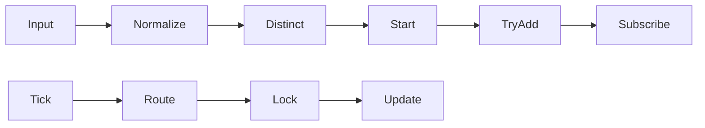

# 002 - Code Review P1/P2 改善規劃

```text
[Env]
  |
  v
[StockConfig] ---> [Symbols(unique)]
                       |
                       v
                    [Orchestrator.Start]
                       |
        +--------------+--------------+
        |                             |
        v                             v
[GenMap(ConcurrentDict)]        [Broker.Subscribe*]
        ^
        |
[OnTickReceived] -> [RouteBySymbol] -> [SymbolLock] -> [KBarGenerator.Update]
```

## 範圍與目標

- 處理 review 議題：
- `P1`：`TradingOrchestrator` 的 `_kBarGenerators` 在 `Start()` 寫入與 `HandleTick()` 讀取存在併發風險。
- `P2`：`StockConfig.GetSymbols()` 未去重，會造成重複訂閱與行為不一致。
- 本次只做必要修正，維持 KISS/YAGNI，不改 `IBrokerClient` public contract。

## Review 議題對照

### P1 - `_kBarGenerators` 併發讀寫不安全

- 問題位置：`AiStockAdvisor.Application/Services/TradingOrchestrator.cs:61`, `AiStockAdvisor.Application/Services/TradingOrchestrator.cs:78`
- 現況：
- `Start()` 迴圈中 `_kBarGenerators[symbol] = gen` 持續寫入。
- `OnTickReceived` 可能在另一執行緒立即觸發 `HandleTick()`，同時 `TryGetValue` 讀取。
- 風險：
- `Dictionary<TKey, TValue>` 非 thread-safe，可能拋例外或路由遺失。
- 同 symbol 多執行緒同時進入 `KBarGenerator.Update()` 也可能破壞 bar 狀態。

### P2 - `GetSymbols()` 未去重

- 問題位置：`AiStockAdvisor.Infrastructure/Configuration/StockConfig.cs:24-28`
- 現況：
- `STOCK_SYMBOLS=2327,2327` 會回傳重複值。
- 風險：
- orchestrator 重複呼叫 `Subscribe/SubscribeBest5`。
- `_kBarGenerators[symbol]` 後寫覆蓋前寫，行為不一致。

## 設計決策

- `P1` 採用 `ConcurrentDictionary<string, KBarGeneratorState>`（推薦，改動最小且夠用）。
- 每個 symbol 維護一個 `SyncRoot`，在 `HandleTick` 對該 symbol 上鎖後再 `Update`，避免同檔併發更新。
- `P2` 在 `StockConfig` 進行正規化 + 去重（`OrdinalIgnoreCase`，保留首次順序）。
- Orchestrator 再加一層防禦式去重：`TryAdd` 失敗就略過訂閱並記 log。

## 實作細節（可直接照做）

### 1) `TradingOrchestrator` 改造

檔案：`AiStockAdvisor.Application/Services/TradingOrchestrator.cs`

關鍵結構：

```csharp
using System.Collections.Concurrent;

private readonly ConcurrentDictionary<string, KBarGeneratorState> _kBarGenerators;

/// <summary>
/// 單一股票的 KBarGenerator 與同步鎖。
/// </summary>
private sealed class KBarGeneratorState
{
    /// <summary>
    /// 初始化 <see cref="KBarGeneratorState"/>。
    /// </summary>
    /// <param name="generator">對應股票的 KBar 產生器。</param>
    public KBarGeneratorState(KBarGenerator generator)
    {
        Generator = generator;
        SyncRoot = new object();
    }

    /// <summary>
    /// 取得對應股票的 KBar 產生器。
    /// </summary>
    public KBarGenerator Generator { get; }

    /// <summary>
    /// 取得該股票的更新鎖物件。
    /// </summary>
    public object SyncRoot { get; }
}
```

`Start()` 核心邏輯：

```csharp
foreach (var rawSymbol in symbols)
{
    var symbol = rawSymbol?.Trim();
    if (string.IsNullOrEmpty(symbol))
    {
        _logger.LogWarning(LogScope.FormatMessage("[Orchestrator] Skip empty symbol."));
        continue;
    }

    var gen = new KBarGenerator(symbol, _barPeriod);
    gen.OnBarClosed += HandleBar;
    var state = new KBarGeneratorState(gen);

    if (!_kBarGenerators.TryAdd(symbol, state))
    {
        _logger.LogWarning(LogScope.FormatMessage(
            $"[Orchestrator] Duplicate symbol skipped: {symbol}"));
        continue;
    }

    _broker.Subscribe(symbol);
    _broker.SubscribeBest5(symbol);
}
```

`HandleTick()` 核心邏輯：

```csharp
var symbol = tick.Symbol?.Trim();
if (!string.IsNullOrEmpty(symbol) && _kBarGenerators.TryGetValue(symbol, out var state))
{
    lock (state.SyncRoot)
    {
        state.Generator.Update(tick);
    }
}
```

### 2) `StockConfig.GetSymbols()` 去重

檔案：`AiStockAdvisor.Infrastructure/Configuration/StockConfig.cs`

```csharp
public static string[] GetSymbols()
{
    var raw = System.Environment.GetEnvironmentVariable(EnvKey);
    if (string.IsNullOrWhiteSpace(raw))
    {
        return new[] { DefaultSymbol };
    }

    var seen = new System.Collections.Generic.HashSet<string>(System.StringComparer.OrdinalIgnoreCase);
    var result = new System.Collections.Generic.List<string>();

    foreach (var s in raw.Split(','))
    {
        var symbol = s.Trim();
        if (string.IsNullOrEmpty(symbol))
        {
            continue;
        }

        if (seen.Add(symbol))
        {
            result.Add(symbol);
        }
    }

    return result.Count > 0 ? result.ToArray() : new[] { DefaultSymbol };
}
```

## 測試計劃



### A. `MultiStockOrchestratorTests` 新增

- `Start_WithDuplicateSymbols_ShouldSubscribeOnlyOncePerSymbol`
- 驗證 `Subscribe("2327")` 與 `SubscribeBest5("2327")` 各只被呼叫一次。
- `HandleTick_WhenStartAndTickRace_ShouldNotThrow`
- 模擬 `Subscribe` 期間觸發 tick，驗證無例外且流程可完成。

### B. `StockConfigTests` 新增

檔案建議：`AiStockAdvisor.Tests/Infrastructure/Configuration/StockConfigTests.cs`

- `GetSymbols_WhenEnvMissing_ShouldReturnDefault`
- `GetSymbols_ShouldTrimRemoveEmptyAndDistinct`
- `GetSymbols_ShouldPreserveFirstAppearanceOrder`
- `GetSymbols_WhenAllTokensInvalid_ShouldReturnDefault`

## 驗收標準

- `_kBarGenerators` 不再使用非 thread-safe `Dictionary` 做併發讀寫。
- 重複 symbol 不會造成重複 `Subscribe/SubscribeBest5`。
- `STOCK_SYMBOLS=2327,2327, 2330` 解析結果為 `["2327","2330"]`。
- 新增測試全數通過，既有 multi-stock 測試不回歸。

## 非目標（這次不做）

- 不新增動態訂閱/取消訂閱功能。
- 不改 broker interface。
- 不調整策略演算法。

## 參考檔案

- `AiStockAdvisor.Application/Services/TradingOrchestrator.cs`
- `AiStockAdvisor.Infrastructure/Configuration/StockConfig.cs`
- `AiStockAdvisor.Tests/Application/MultiStockOrchestratorTests.cs`
- `/doc/features/001-serialno-gap-alert/review-notes.md`


