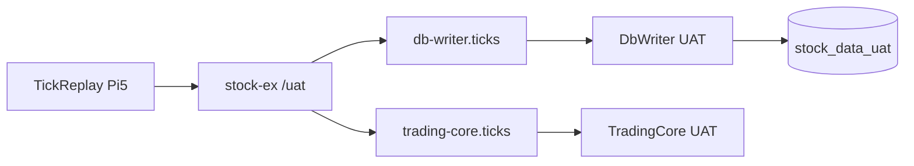

# UAT 隔離環境 + TickReplay 規劃（Pi5 本機，零污染正式環境）

## Summary

你要先做兩件事：
1. 複製一條可測試的流程環境（不影響現在正式上線 flow）
2. 規劃 TickReplay，發送到 UAT RabbitMQ，且絕不寫到正式 DB

本版範圍只做這兩件，不含 Notifier/完整事件流擴充。

## 架構（ASCII）

```text
[TickReplay@Pi5] -> [RabbitMQ /uat stock-ex] -> [db-writer.ticks] -> [DbWriter-UAT] -> [PostgreSQL stock_data_uat]
                                           \-> [trading-core.ticks] -> [TradingCore-UAT]
```

## 架構（Mermaid）



## 範圍

### In Scope

1. 在同一台 RabbitMQ 上用不同 vhost 建 UAT 流程
2. UAT 用獨立 DB `stock_data_uat`
3. TickReplay（檔案回放）設計與驗收規格
4. 防呆機制：避免誤連正式 `/` vhost 或 `stock_data`

### Out of Scope

1. Notifier/交易事件流完整驗收
2. 正式服務架構調整
3. 高負載壓測

## 決策完成（不留實作者決策）

1. TradingCore + TickReplay 都在 Pi5
2. MQ 隔離：同 broker，不同 vhost（固定 `/uat`）
3. DB 隔離：同 Postgres，不同資料庫（固定 `stock_data_uat`）
4. UAT 內沿用同名 `stock-ex` / `stock.twse.tick` / `db-writer.ticks`，靠 vhost 隔離
5. 回放模式：CSV 檔案回放，低負載預設 `100 ticks/sec`

## RabbitMQ UAT 規格

- VHost: `/uat`
- Exchange: `stock-ex`（direct, durable=true）
- Queue:
1. `db-writer.ticks`（durable=true）
2. `trading-core.ticks`（durable=false, `x-message-ttl=3000`, `x-max-length=3000`, `x-overflow=drop-head`, `x-expires=600000`）
- Binding:
1. `stock-ex -> db-writer.ticks` with `stock.twse.tick`
2. `stock-ex -> trading-core.ticks` with `stock.twse.tick`

## 帳號與權限（UAT 專用）

1. `stock-sim-publisher-uat`：write=`^stock-ex$`, read=`^$`, configure=`^$`
2. `dbwriter-uat`：read=`^db-writer\.ticks$`, write=`^$`, configure=`^$`
3. `tradingcore-uat`：read=`^trading-core\.ticks$`, write=`^$`（這版先不發事件）, configure=`^$`
4. 上述帳號不得賦權 `/` vhost

## TickReplay 規格（公開介面）

### CLI 契約

1. `--input <csv-path>`
2. `--rate <ticks_per_sec>`（default: 100）
3. `--amqp-uri amqp://<user>:<pass>@<host>:5672/uat`
4. `--exchange stock-ex`（default）
5. `--routing-key stock.twse.tick`（default）
6. `--symbol <override>`（optional）
7. `--start-seq <int>`（default: 1）
8. `--dry-run`（只印 payload，不送 MQ）

### CSV 欄位（固定）

1. `tradeDate`（yyyy-MM-dd）
2. `marketNo`
3. `stockCode`
4. `tickTime`（HH:mm:ss.fff）
5. `dealPriceRaw`
6. `dealVolRaw`
7. `buyPriceRaw`（optional, default 0）
8. `sellPriceRaw`（optional, default 0）
9. `inOutFlag`（default 0）
10. `tickType`（default 0）

### 輸出 payload

固定對齊既有 `TickMessage` JSON 結構。

## 防污染強制機制（必做）

1. TickReplay 啟動前檢查：
   - vhost 必須是 `/uat`
   - 若是 `/` 直接 fail-fast 結束
2. DbWriter-UAT 啟動前檢查：
   - `Database` 必須是 `stock_data_uat`
   - 若是 `stock_data` 直接 fail-fast 結束
3. TradingCore-UAT 啟動前檢查：
   - vhost 必須是 `/uat`
4. UAT 啟動腳本加 guard：
   - 偵測到 `/` 或 `stock_data` 立刻中止流程
5. UAT 使用者不可訪問 `/`，從權限面雙重阻擋誤發送

## 需要變更的公開設定介面

1. `RABBITMQ_URI`：所有 UAT 服務固定用 `/uat`
2. `TIMESCALE_DB_DATABASE`：固定 `stock_data_uat`
3. `UAT_GUARD_ENABLED=true`：啟用 fail-fast guard
4. TickReplay CLI 為新增公開介面（上述參數）

## 實作順序

1. Infra：建立 `/uat` + users + permissions + topology
2. DBA：建立 `stock_data_uat` + uat 專用 DB 帳號（最小權限）
3. DbWriter：支援 UAT guard（db name/vhost 檢查）
4. TradingCore：支援 UAT guard（vhost 檢查）
5. TickReplay：完成 CSV 回放 + guard + dry-run
6. Harness：`run-uat-replay.ps1` 一鍵啟動、驗證、報告

## 測試案例

1. `Isolation-Auth`：UAT publisher 嘗試連 `/` 必須被拒絕
2. `Isolation-DB`：DbWriter-UAT 指到 `stock_data` 必須啟動失敗
3. `Nominal-Replay`：回放 10,000 筆，DbWriter-UAT 寫入 `stock_data_uat`
4. `No-Prod-Pollution`：回放後正式 DB 筆數不變、正式 queue message 不變
5. `TC-Backlog-Control`：TradingCore 關閉 5 分鐘後恢復，`trading-core.ticks` 不爆量

## 驗收標準

1. 正式 `/` vhost 與正式 DB 零變動
2. `stock_data_uat` 寫入完整率 >= 99.9%
3. TickReplay 在錯誤目標（`/` 或 prod db）時 100% fail-fast
4. UAT queue 深度與資源佔用符合 TTL/max-length 設計

## Assumptions / Defaults

1. Pi5 資源足夠同時跑 TradingCore + TickReplay + 既有服務
2. 可以建立新 vhost `/uat` 與新 DB `stock_data_uat`
3. 先不納入 Notifier 事件流
4. 負載先低負載（100 ticks/sec）
