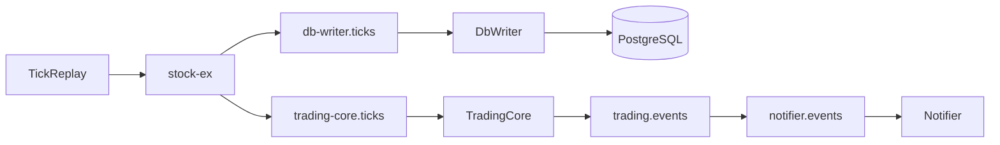

# UAT 全流程測試環境規劃（分機部署 + Tick 檔案回放）

## 摘要

目標是建立一套可重複執行的 UAT 環境，覆蓋 `Tick -> RabbitMQ -> DbWriter + TradingCore -> TradingEvent -> Notifier`。  
Tick 來源使用檔案回放，部署採現有分機拓樸，驗收採自動化腳本 `pass/fail`。

## 架構總覽（ASCII）

```text
[TickReplay] -> [RabbitMQ stock-ex] -> [db-writer.ticks] -> [DbWriter] -> [PostgreSQL]
                         |
                         +-> [trading-core.ticks] -> [TradingCore] -> [trading.events] -> [Notifier]
```

## 架構總覽（Mermaid）



## 環境與拓樸

1. 採分機部署。
2. RabbitMQ/DbWriter/Notifier 在 Pi5。
3. TradingCore 與 TickReplay 在 Windows 測試機。
4. 建立獨立 vhost `/uat`，避免污染現行 `/`。

## RabbitMQ 設計

| 項目 | 名稱 | 型別 | Durable | 參數 |
| --- | --- | --- | --- | --- |
| Exchange | `stock-ex` | direct | true | - |
| Exchange | `trading.events` | topic | true | - |
| Queue | `db-writer.ticks` | classic | true | - |
| Queue | `trading-core.ticks` | classic | false | `x-message-ttl=3000`, `x-max-length=3000`, `x-overflow=drop-head`, `x-expires=600000` |
| Queue | `notifier.events` | classic | true | - |

| Binding | Source -> Queue | Routing Key |
| --- | --- | --- |
| Tick to DbWriter | `stock-ex -> db-writer.ticks` | `stock.twse.tick` |
| Tick to TradingCore | `stock-ex -> trading-core.ticks` | `stock.twse.tick` |
| Event to Notifier | `trading.events -> notifier.events` | `trade.#` |

## 帳號與最小權限（/uat）

1. `stock-sim-publisher`: `configure=^$`, `write=^stock-ex$`, `read=^$`
2. `dbwriter-uat`: `configure=^$`, `write=^$`, `read=^db-writer\.ticks$`
3. `tradingcore-uat`: `configure=^$`, `write=^trading\.events$`, `read=^trading-core\.ticks$`
4. `notifier-uat`: `configure=^$`, `write=^$`, `read=^notifier\.events$`

## Tick 模擬來源規格

1. 新增 `TickReplay` 工具（建議獨立小專案/小 repo，.NET 8）。
2. 僅支援檔案回放（這版固定 CSV）。
3. CLI 介面固定：
   - `--input <path>`
   - `--rate <ticks_per_sec>`（預設 100，低負載）
   - `--exchange stock-ex`
   - `--routing-key stock.twse.tick`
   - `--amqp-uri amqp://stock-sim-publisher:***@<host>:5672/uat`
   - `--start-seq <int>`（預設 1）
   - `--symbol <code>`（可覆蓋檔案）
4. Payload 固定對齊既有 `TickMessage` JSON 欄位：`tradeDate/key/marketNo/stockCode/serialNo/tickTime/buyPriceRaw/sellPriceRaw/dealPriceRaw/dealVolRaw/inOutFlag/tickType`。

## 必做相容修正

1. `TickMessage.ToDomainTick()` 容錯 `tickTime.year/month/day` 缺省值。
2. 規則固定：若 `year/month/day <= 0`，改用 `tradeDate + hour/minute/second/msec` 組時間。
3. 先在 Contracts 套件修正，避免 TradingCore 消費時因時間欄位缺省拋例外。

## 自動化驗收腳本設計

1. 新增一鍵腳本 `run-uat-flow-test`（PowerShell）：
   - 建立或驗證 RabbitMQ topology 與權限
   - 啟動或檢查 DbWriter/TradingCore/Notifier
   - 啟動 TickReplay 回放指定檔案（低負載）
   - 等待處理完成
   - 拉取 queue 深度、DB 寫入數、Notifier 事件數
   - 輸出 `pass/fail` 報告與指標摘要
2. 報告輸出固定：`artifacts/uat/<yyyyMMdd-HHmmss>/summary.json` + `summary.md`。

## 驗收案例

1. `Nominal`: 全服務在線，回放 10,000 筆 tick。
2. `TradingCoreOffline`: TradingCore 關閉 5 分鐘後恢復。
3. `NotifierOffline`: Notifier 關閉 3 分鐘後恢復。
4. `BrokerReconnect`: 回放中斷 RabbitMQ 連線 30 秒後恢復。
5. `MalformedTick`: 混入 1% 格式錯誤資料，確認不會中斷整體 flow。

## 驗收標準

1. `Nominal`: DbWriter 寫入成功率 `>= 99.9%`。
2. `Nominal`: TradingCore 有消費紀錄且處理不中斷（真實策略下不以固定事件筆數為準）。
3. `TradingCoreOffline`: `trading-core.ticks` 不無限成長，恢復後 60 秒內回到穩態。
4. `NotifierOffline`: 恢復後可補收離線期間事件（可靠送達語意）。
5. `MalformedTick`: 錯誤資料被隔離或記錄，其他資料持續流動。

## 需要新增或變更的公開介面與型別

1. 新增 `TickReplay` CLI（上述參數為公開契約）。
2. 調整 `TickMessage.ToDomainTick()` 時間組裝邏輯（相容修正，非 breaking）。
3. 若 TradingCore/Notifier 尚無健康檢查端點，新增 `/health` 供驗收腳本判定就緒。

## 實作分工順序

1. Infra repo：建立 `/uat` vhost、users、permissions、exchanges、queues、bindings。
2. TickReplay repo：完成 CSV 回放器與 CLI。
3. DbWriter repo：確認 consume `db-writer.ticks`（/uat）。
4. TradingCore repo：確認 consume `trading-core.ticks` + publish `trading.events`。
5. Notifier repo：確認 consume `notifier.events`。
6. Contracts repo：補 `ToDomainTick()` 容錯。
7. Test harness repo：一鍵 `run-uat-flow-test` + 報告輸出。
8. 文件：同步維護本檔。

## 假設與預設

1. Flow 範圍：包含通知流。
2. 部署型態：沿用現有分機。
3. Tick 來源：檔案回放。
4. TradingCore queue：近即時最小保留（TTL + max-length + drop-head）。
5. 驗收方式：自動化驗收腳本。
6. Notifier 可靠性：可靠送達。
7. 事件產生：真實策略（驗收採存在性與穩定性，不採固定事件筆數）。
8. 負載檔位：低負載（50~200 ticks/sec，預設 100）。
